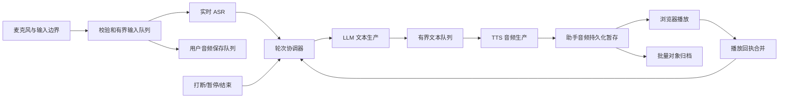

# 语音面试响应与对话质量改进方案

日期：2026-09-11。状态：**工程改造已实施，发布与真人性能/质量验收未完成**。

本方案保留原始诊断和目标；下文“当前代码”等分析指改造前基线。最新实现与验证见 [整体改造报告](remediation-report.md) 和 [逐项核对表](remediation-status.md)。

依据：[本次测试面试记录](https://test.interview.energylt.com/admin/interviews/13c6d787-bb26-46b8-80ca-532af6c92932)、该场事件/音频片段元数据/岗位版本/摘要任务，以及本项目和三个参考项目的源码。产品约束仍以 [PRD](prd.md)、[技术方案](technical-plan.md)、[实施说明](implementation-brief.md) 为准。

## 1. 建议先改什么

优先完成三个直接影响候选人的改动：**开口能立即打断；说完能及时得到回应；已经回答或纠正的内容不再反复追问。** 保留当前 ASR → LLM → TTS 架构，先修轮次控制、音频输入连续性和对话上下文表达，再用相同案例比较模型。现有证据不足以把问题归因于模型“thinking 太久”。

原建议中的四项都保留，但调整实施次序：

| 原建议 | 本次修订 |
| --- | --- |
| 判停、误打断 | 升为 P0；增加静音后 ASR 判停、已完成回复的状态清理、取消后禁止无条件重问 |
| 首音、句间衔接 | P1；LLM 和 TTS 并行流水线、首包与播放缓冲按时长控制 |
| 减少保存等待 | 控制消息与实时 ASR 脱离对象存储等待列为 P0；完整持久化管线在 P1 收尾 |
| 上下文管理 | 对话视图和 Prompt 列为 P0；Token 预算、后台摘要、长发言缓存列为 P2 |

**本次的“显得不理解人”同时包含交互故障和对话策略问题。** 重新生成旧问题、迟到的识别文本、未听完的问题被当作已问过，会破坏对话顺序；只有消除这些问题后，模型质量比较才有意义。

## 2. 这场面试实际发生了什么

### 2.1 核对范围与限制

- 时间：2026-09-11 15:37:42～15:43:52（北京时间），墙钟约 369.8 秒，有效时长约 364.3 秒，手动结束，真实供应商模式。
- 共 312 条事件：8 条候选人回答、33 条生成文本、267 条播放回执，另有选岗、开始和结束事件。33 条文本属于 **17 个 response_id**，不能将每句文本都算一次模型调用。
- 开场加 8 次回答通常对应 9 次正常回复机会；实际出现 17 个回复编号，其中 **8 次与前一次回复之间没有新的候选人回答入库**。记录没有 generation-start/cancel 的完整原因，不能逐次断言都是噪声导致。
- 当前运行 Relay 镜像为 `26917d955e1bebc7bd0a8f9b436d74470d701629`；本地 `1840c90370b6ba662bc968554ce5335928bbb7d2` 相比它只有文档差异。以下源码分析可对应当前部署代码；该场没有冻结完整供应商配置，无法证明模型别名在历史时刻解析到的具体供应商版本。
- 核对时运行配置：LLM `deepseek-chat`，ASR `qwen-audio-3.0-asr-flash-streaming`，TTS `tokendance` / `seed-tts-2.0`。环境里另有 OpenAI TTS 的兼容配置，不代表本场使用了它。
- 本次读取了原始事件与存储元数据，**没有逐段人工听辨录音**。ASR 是否漏词/错词、扬声器回声、实际人声结束点，仍需实机复现和音频对齐验证。本文只保留脱敏现象与统计，不提交完整对话、音频地址或凭据。

### 2.2 可确认的对话问题

以下时间从会话建立开始计算，`seq` 是原始事件序号，方便在授权控制台核对。

| 时间 / 事件 | 可确认现象 | 影响 |
| --- | --- | --- |
| 7.1、15.6、35.8 秒；seq 4/9/26 | 相同开场和自我介绍请求生成了 3 次；中间没有新的候选人回答事件 | 候选人刚开始就被重复开场打断 |
| 110.6～169.5 秒；seq 87～146 | 回答项目与角色后，候选人指出自己说过了；系统先解释想了解模块，随后又在无新回答入库时重复模块问题 | 必须区分“合理深入到模块”与“调度重放造成的重复”，不能把所有追问一概禁止 |
| 177.3～214.8 秒；seq 162～197 | 已收到模块信息及对重复提问的抱怨；随后两次回复出现明显等待，并继续围绕相近问题发问 | 道歉后仍缺乏有效推进 |
| 231.9～277.9 秒；seq 212～257 | 候选人表示没有技术难点，系统转问挑战最大的功能，随后又重复这一角度 | 需要识别拒绝展开/无此经历，换成具体实现问题或其他维度 |
| 282.1～318.5 秒；seq 266～288 | 收到 Agent Loop 相关回答后，解释实现方式的问题再次生成两遍 | 最新信息虽被读到，轮次推进仍不稳定 |
| 337.0～341 秒；seq 303～311 | 候选人要求结束，系统生成了第三人称的内部操作说明；对应音频有约 3.0 秒播放确认 | 工具调用说明混入可朗读内容，候选人听到的不是自然回应 |

这不是“完全没有记忆”：模型多次正确引用了前文的经验、模块和 Agent Loop。主要问题是**对话顺序不可靠，纠正后未有效调整，而且旧问题会重新生成**。

### 2.3 延迟证据：严格区分不同计时点

`generated.created_at` 是首段可朗读文字的入库时间，发生在分句之后，不是模型首 Token。`audio_through_ms` 是该连接已向实时 ASR 送入的音频覆盖进度，不是候选人的实际说完时刻。下面两列都不能直接当作端到端响应延迟。

| 回答事件 | 回答入库时刻 | 入库→下一条生成文本 | 入库时刻－音频覆盖进度 |
| --- | ---: | ---: | ---: |
| seq 44 | 57.883 秒 | 1.664 秒 | 1.392 秒 |
| seq 87 | 110.570 秒 | 1.340 秒 | 0.863 秒 |
| seq 95 | 117.028 秒 | 0.759 秒 | 7.321 秒 |
| seq 162 | 177.251 秒 | **11.273 秒** | 0.519 秒 |
| seq 192 | 202.289 秒 | **9.774 秒** | 0.741 秒 |
| seq 212 | 231.921 秒 | 1.291 秒 | 7.172 秒 |
| seq 266 | 282.098 秒 | 1.107 秒 | **17.134 秒** |
| seq 303 | 337.027 秒 | 1.345 秒 | **27.253 秒** |

对应 8 次回复的首个已确认播放片段，其客户端上报开始时间距回答入库约为 2.50、2.58、1.63、12.22、10.68、2.65、1.91、2.24 秒。这仍不是“说完→听到”：缺少人声结束时间，且客户端与服务器时钟没有校准。这些数据只证明部分等待在回答入库前，另有两次明显等待在入库后，不能简单用一个平均数解释。

还发现了更关键的输入连续性异常：存储中候选人音频共 498 个 200 毫秒片段，合计 **99.6 秒**，采集时间轴覆盖约 5.843～309.774 秒；期间有 **10 段超过 1 秒的空白，实际为 14.2～38.8 秒**。没有对应的暂停/恢复事件，但静音操作本来就没有记事件。因此这里可能包含主动静音、浏览器采集停顿或缺失音频，**不能直接认定为保存队列积压或数据丢失**。

录音状态为 `partial`，当前标记是 22 个无播放确认和 6 个部分播放片段。正常打断也会造成这类标记，它们不能直接证明播放出错；当前录音拼接逻辑也没有把上述麦克风时间轴空白细分为静音或采集缺失。

### 2.4 本次不是摘要压缩导致遗忘

该场只有一个摘要，版本 1，在约 **340.053 秒**生成，覆盖到 seq 94；上述开场重复和中途重复发生时，它还不存在。最长候选人回答只有 38 个字符，也没有触发 `buildContext()` 的 8,000 字符长发言压缩。

所以，摘要质量和 Token 预算值得完善，但不是这次前半程体验问题的首要解释。

## 3. 从代码追到的原因与待验证假设

### 3.1 输入断流与多层判停叠加

已确认的代码行为：

1. 麦克风每 200 毫秒出一包；`mutedRef.current` 为真时，回调直接返回，既不上传声音，也不发送静音切换/结束当前输入的控制事件。
2. DashScope 配置 `max_sentence_silence=1000`；拿到最终文本后，`LiveASR` 再等 1,300 毫秒；回答入库后，Relay 又等 350 毫秒才生成。理想顺序下可形成约 2.65 秒等待，但供应商行为和多次 activity 会改变实际值，不能认作每轮固定耗时。
3. ASR 的 keepalive 每 5 秒检查一次，DashScope 分支补 6,400 字节，即 **200 毫秒静音 PCM**。它不是正常实时静音流。
4. ASR 临时文本也会调用 `activity()`，清除现有 silence timer；如果之后不再有 final 或触发重排的 touch，pending final 可能继续滞留。需要覆盖“已有 final→新的 interim→没有后续 final”的场景。

**高优先级假设**：若候选人说完马上静音，供应商收不到后续实时静音，1 秒音频静音可能需要约 5 次保活、约 25 秒墙钟才凑足。这与末尾 17～27 秒音频进度差具有一致性，但缺少静音事件和供应商 final 时间戳，尚未证实是本场的实际原因。若用户全程未静音，就应优先查采集、发送和服务器接收的空白。

官方文档确认当前模型使用 `max_sentence_silence`，而另一种 Qwen3 Realtime 协议使用 `silence_duration_ms`；不能直接混用参数。`semantic_punctuation_enabled` 也会影响 final 判定。实施时必须记录生效参数并实测，而不是只把 1,000 改成 400。参考：[阿里云实时 ASR 参数](https://help.aliyun.com/zh/model-studio/fun-asr-realtime-java-sdk)。

源码：`public/mic-worklet.js:25`、`features/interview/use-voice-session.ts:170/421`、`server/asr.ts:40/112`、`server/speech-provider.ts:112/175`、`server/relay.ts:261`。

### 3.2 打断与“5 秒后重问”没有分清状态

- 前端 RMS 超过 `0.025` 且距上次超过 350 毫秒就调用 `interrupt()`，没有持续人声确认，也没有检查当前到底处于等待回答、生成还是播放。浏览器 AEC/降噪已开启，但这不等于已经可靠排除回声和噪声。
- 本地 `stopPlayback()` 已经存在，所以代码**没有设计成必须等 AI 说完才能停声**。症状可能来自本地检测漏触发、ASR 迟到或后续回复被阻塞，必须分别测“停声延迟”和“新回复延迟”。
- 服务端 `interruptGeneration()` 只要看到 `responseId` 就取消，并设置 `interruptedAt`；monitor 超过 5 秒就重新 schedule。普通回复生成完、播放完后，`responseId` 没有明确转入 completed 并清理。
- 结果是已经播完的问题，也可能被后续声音活动误当作“需要中断的回复”，再因未收到新文本而自动重问。这个机制能解释无新回答情况下重复生成的形态，但现有记录无法逐次还原触发源。

源码：`features/interview/use-voice-session.ts:88/114/178/314`、`server/relay.ts:72/234/268/555`。

### 3.3 存储等待进入语音热路径

- 所有 WebSocket 消息共用 `sequence`，包括音频、interrupt、played、heartbeat；ASR 的 `commitText()` 也进入同一条链。
- 每个用户音频片段先查询/校验，再 `putObject()`、写 chunks、回 `audio_saved`，最后才 `asr.send()`。音频存储慢时，识别输入、打断、回执都可能排队。
- 输出端每段 PCM 先写对象存储、再写数据库、再发送浏览器。`valid()` 在生成/音频循环中反复查数据库。
- `pendingPlayback >= 8` 会阻塞继续输出；播放回执又排在输入持久化后，存储慢会间接卡住输出。它不一定是死锁，但会扩大延迟。

这些阻塞顺序由代码确定；本场缺少各步骤 span，**无法量化数据库、对象存储各占多少毫秒**。

源码：`server/relay.ts:82/151/190/202/340/370/434/446/482`。

### 3.4 LLM、TTS 和播放没有充分重叠

`for await (part of streamModel)` 内部嵌套完整的 `for await (pcm of synthesizeStream)`。应用必须等上一段 TTS、保存和背压处理完，才继续消费模型文本。模型/网络可能仍在缓冲后续 Token，不能据此声称模型本身停止计算，但下一段文字和工具结果的应用侧处理确实会晚。

此外，分句只按句号、问号、分号和换行；长逗号句没有首段长度/等待时间上限。TTS 每包 500 毫秒、服务端最多 8 包待确认，即名义上约 4 秒播放窗口。**凑够 500 毫秒 PCM 不等于额外固定等待 500 毫秒墙钟**，但会增加首音缓冲要求。

源码：`server/model.ts:137`、`server/tts.ts:135`、`server/relay.ts:151/190/195`。

### 3.5 模型拿到的是事件表，而不是清楚的对话状态

- `buildContext()` 将最近事件序列化成一段 user JSON，包含存储标识与播放元数据；没有正常的 user/assistant 轮次投影，最新发言也没有单独突出。模型需要自己推断哪些是回答、修订、生成但未播完的话。
- `contextEvents()` 已做播放回执聚合，不能说当前每轮把 267 条 playback 全部原样发送。但生成文本仍按句列出，取消/已完成回复状态没有清晰语义。
- 每次生成都追加“若刚选岗，请开场；若暂停恢复，请接上当前问题”的泛化提示。岗位 Prompt 又含“先邀请自我介绍”。实际触发原因没有显式区分，增加了重复开场和重问的可能性。
- 现有 Prompt 写了“简洁、避免重复”，却缺少应对纠正、抱怨、澄清、不愿展开的可执行示例；工具虽有独立通道，模型输出的内部说明仍会直接送 TTS。

源码：`server/context.ts:7/43/105`、`server/model.ts:7/103/137`、`server/relay.ts:143`。

## 4. 三个参考项目：借什么，避免照搬什么

这里的 Alice 是 `/Users/circle/git/alice` 桌面恢复项目，**不是**此前用于登录参考的 `/Users/circle/git/alice-a2a`。WorkBuddy 也是本地恢复项目。以下是源码可见机制，不代表已在同样网络、语音供应商或面试场景下做过性能对比；没有证据说明它们整体一定更快。

| 项目与核对版本 | 可确认机制 | 本项目如何借鉴 | 边界 |
| --- | --- | --- | --- |
| WorkBuddy `aeef7d7` | 按模型/会话的有效上下文窗口计算压缩阈值；区分普通压缩与输入+最大输出可能溢出的阻塞压缩；有 30 秒冷却、检查压缩后是否新增实质内容 | Token 预算包含输出预留；摘要只对新增前缀触发；把是否阻塞与是否需要摘要分开 | 不能照搬其约 92% 应急阈值作为语音应用的提前摘要阈值；工具结果裁剪不能用于删候选人原文 |
| WorkBuddy `aeef7d7` | SessionManager 显式记录取消来源/原因，再请求停止并调用 backend.cancel；压缩输出有代次标识 | 记录 barge-in/noise/pause/timeout/takeover 等原因；旧回复完成回调不能改变新状态 | 桌面取消不是实时语音 VAD；不要引入整套侧车、工具 Agent Loop 或多 Agent 来修首音 |
| Alice `de13232` / 恢复自 0.5.44 | Worker 构造 ContextManager 并传入 contextThresholds；流式消费 AgentQuery；模型与 enableThinking 可配置；独立 abort 消息触发 AbortController；LLM 调用事件和 usage 上报 | 显式模型能力/上下文配置；取消与普通业务等待分离；记录模型请求开始、首 Token、结束、用途及用量 | 本次能核实 Worker 接线；核心 chunk 仍混淆，未完整证实其内部压缩策略和延迟。Worker 的 131072 初始容量不可当作所有模型的真实窗口 |
| aural-oss `f87b06a` | ASR 会话更新归一、重复 final 抑制、连续片段合并；保留被打断的 interim，待讲话稳定再提交；有回声启发式和识别卡住后的恢复路径 | 设计明确的 utterance/revision/ASR connection 标识；打断后仍接收用户输入；稳定 interim 的兜底保留修订来源 | 文本相似度不能用来删掉用户有意重复/纠正；各类定时器需要整合，不能原样叠加 |
| aural-oss `f87b06a` | TTS 流式发送；浏览器抖动缓冲以时长控制，目标 120ms、最长等待 180ms、批次上限 260ms；结束通过播放确认判断 | 首包更短，后续缓冲维持连续性；合成完成与播放完成分开记录 | 参数只作为起点；它没有本项目完整的逐片可靠保存契约，不能为了快去掉持久化 |
| aural-oss `f87b06a` | Prompt 明确区分回答、元沟通、澄清、思考与拒绝展开；注入最近回复避免重问 | 让模型先回应当前意图，再自然选择下一个具体问题 | 该实现还存在生成期单字符串排队、结果 suppression、切题清空 questionTranscript 等机制；不要复制这些限制到全场连续上下文 |

具体阅读位置：

- WorkBuddy：`recovered-cli/codebuddy-headless.beautified.js:159726`（压缩触发与冷却）、`:159781`（输出预留）、`:180799`（有效窗口）、`:181476`（工程压缩）；`recovered-source/packages/workbuddy-server/src/session/session-manager.ts.recovered.js:1513`（取消）。`reports/agent-runtime-technical-design.md` 明确是另一个 Agent Engine 的未实现方案，本文没有把它当成现有功能证据。
- Alice：`src-recovered/workers/agent-worker.js:24/32/89/115/244/258/293`；恢复保真度边界见 `docs/RECOVERY.md:35`。没有为本方案执行混淆代码或修改参考仓库。
- aural-oss：`server/voice-relay.ts:1380/1405/1566/1666/2004/2540/2595/2920`；`server/voice-relay-prompts.ts:482`；`src/lib/voice/playback-jitter-buffer.ts:1`；不要复制的切题重置在 `server/voice-relay.ts:2270/2358`。
- 只借鉴行为与契约重新实现。若后续直接复用 aural-oss 代码，保留其 MIT 版权与许可；恢复项目的私有实现不直接复制进本仓库。

## 5. 目标实现

### 5.1 一个轮次协调器，分开“检测到声音”“接到回答”“需要回复”

保留 `session_id + epoch`，增加 `input_turn_id + revision + response_id + generation`。生成触发原因限制为 `opening / user_turn / explicit_resume / approved_retry`，每次记录来源回答和触发原因。

回复生命周期明确分成 generating、streaming、draining、completed、cancelled、failed。`generation_done` 只代表供应商输出结束；音频队列和待确认片段清空后才 completed。completed 后的声音不再取消旧回复，也不触发重问。

候选人开口时，浏览器先降低或停止当前声音，不等待网络。将本地人声检测与 200 毫秒上传分包解耦：AudioWorklet 以约 20 毫秒窗口给出活动特征，结合约 60～120 毫秒持续活动和噪声底线确认；具体阈值通过轻声/外放样本校准。否则沿用 200 毫秒 RMS 再要求多包确认，本身就很难达到 250 毫秒停声目标。可信人声确认后，Relay 立即取消旧模型/TTS并使旧代次失效。噪声误触发采用短暂降音量/暂停后恢复已有音频的策略；若已做不可恢复的停止，就等待候选人继续或提示一次，**禁止 5 秒后凭空重新调用模型重复旧问题**。显式点击暂停/结束仍走确定性控制通道。

输入采用同一个判停截止时间：供应商 final、最新人声活动和文本变化共同更新它，不再 final 后固定追加 1.3 秒和 350 毫秒两层等待。先用约 700～1,000 毫秒作为普通回答静默窗口实验值；长回答中的停顿、未完成短语适当延长，最长等待用来触发诊断/恢复，不强行把仍在讲话的答案截断。是否追问、澄清或结束仍由 Prompt 决定，不另加串行“意图分类模型”。

ASR 修订采用 append-only 原始事件加 latest-revision 投影。同一供应商重复 final 不触发新回复；不同 input_turn_id 下用户真的再次说相同内容必须保留。旧连接退休期间允许回收其尾部结果，但不能把迟到 interim 当成新一轮开口取消当前回复。

### 5.2 静音也必须有明确协议

浏览器发送幂等的 `input_muted/input_unmuted`，带音频序号边界和单调时钟时间；服务端只把它作为输入状态，不能信任它修改权限。静音后不上传真实麦克风内容。

在当前 DashScope 适配器中，静音边界之后按正常音频节奏补足有界的合成静音，让已收到的最后一句及时完成判停；标记为 `synthetic_silence`，不伪装成候选人原始录音，也不推进“真实采集覆盖”水位。之后保活与判停分开。如供应商明确支持非关闭式 finalization，可由能力配置选择；当前 `finish-task` 会结束连接，不能误用成无代价的 flush。

未静音却持续收不到音频时，区分 capture、client-send、server-receive、ASR-send 四条进度；超时进入可解释的恢复状态，不任由旧问题重播。记录用户主动静音区间，录音页将“主动静音”“采集缺口”“未确认播放”分开呈现。

### 5.3 控制、实时处理与可靠保存分开

消息先完成 schema、连接票据绑定、epoch、大小/速率校验，再分流。interrupt 和播放进度的内存处理不等待对象存储；业务结束/换岗仍以数据库事务为权威。每个会话的输入顺序和唯一性由 frame_seq/input_turn_id 维护，不能把全部消息简单改成无界 `Promise.all`。

建议第一版保存契约：

- 用户音频：进入有界实时队列后即可送 ASR；并行可靠保存。浏览器仍持有未确认片段，只有对象持久化+数据库元数据成功才发 `audio_saved`；重试片段只补存，绝不再次送 ASR。若先收到文本但音频保存未完成，界面显示保存中，不能宣称录音已完整保存。
- 助手音频：没有浏览器重传源，不能仅靠内存 fire-and-forget。先写本项目独立的 PostgreSQL 短期 outbox/音频暂存（或经验证的持久卷 spool），之后发送；Worker 合并归档对象并在归档与引用提交成功后清理暂存。取消后的片段按真实播放回执处理。
- 播放回执：只接受当前连接实际下发过的 chunk，校验归属、代次及播放时长上限后实时释放播放额度；持久化可合并同 chunk 的单调最大值，浏览器收到 `playback_saved` 后才清理可重传回执。未持久化的进度不能用于最终录音/评估认定“已听过”，自然结束等业务决策仍遵守持久化确认边界。
- 容量以音频毫秒数/字节数计量。建议以现有用户端 8 秒未确认音频上限为起点；接近上限提示保存拥塞，达到上限暂停收音并进入恢复，不能静默丢弃或不断扩容。
- 采用 `(session_id, epoch, track, frame_seq/chunk_id)` 幂等键；内容 hash 冲突报错。检查取消代次、归属和截止时间，必须保留旧连接写入/回调隔离。减少逐包 SELECT 不能改成永不刷新权限的内存缓存。
- 先压测暂存写入尾延迟和清理能力，再放开更短音频包；实时模型和摘要/评估使用独立并发额度，避免 Worker 抢走实时容量。

### 5.4 首音更早，后续句子衔接更自然

LLM reader、分句器、TTS consumer 独立运行，同一个 AbortSignal/代次贯穿。文本队列初始上限建议 2 句或 160 个中文字，TTS 首版只维持一个合成请求，利用模型继续输出与上一句合成重叠；不一开始就多路并发 TTS，避免乱序、浪费和供应商限流。

首段优先在合适语义边界发出：初始实验值为 12～24 字、最长约 300 毫秒缓冲，后续句段约 40～80 字；不足以构成自然短语时不机械切碎。人名、数字、英文术语和工具标记不能被错误切开。工具通道尽早独立解析，不能等上一句播放结束才处理有效控制结果。

TTS 首包尝试 120～200 毫秒，后续 200～400 毫秒；前端用 120～180 毫秒抖动缓冲起步，结合真实网络调节。所有队列按音频时长控制，旧的“8 包/12 包”上限不能在包变短后照搬。首句不必加“好的，我们继续”来制造虚假的低延迟，统计还应包含首个有内容的回应。

### 5.5 把面试变成真正的连续对话

增加 `conversation-view.ts`，仅做确定性投影：平台规则/岗位版本/权威事实、摘要、最近轮次、最新回答、修订关系、最后一个问题及实际播放状态。常规已确认轮次使用模型支持的 user/assistant 消息表达；未播完/未确认文本放在有明确标签的状态资料里，不能作为完整听过的问题。没有词级时间戳时，不按“播放百分比”凭空推导听到了哪些字。

每轮显式传 `trigger` 和 `latest_user_turn`，去掉所有轮次共用的“若刚选岗请开场”尾部提示。过去的存储 UUID/逐片回执留在证据账本；投影只保留可追溯的轮次/来源引用和必要播放状态。

Prompt 升级并在岗位发布时冻结版本：

- 先回应本次发言的真实意图，再决定是否提问。抱怨重复、请求澄清和询问能否听到，都不是回答太短。
- 已有信息先承认，再问尚不清楚的一个点；道歉一次即可，随后必须推进。确认“负责哪些模块”与深入“怎么实现某模块”是不同问题。
- 候选人表示没有难点或不想展开时，改问具体实现/取舍或其他维度，不换措辞逼问相同内容。
- 一个回应只承担一个主要问题，建议常规回应 1～2 句，约 25～70 个中文字；这是可调目标，不截断候选人回答，也不硬编码题目树。
- 工具只通过结构化通道产生效果。自然回应使用面向候选人的语言，不朗读“候选人要求……应调用……”等内部计划。建立正反示例和首段输出契约；异常段落不得直接朗读，修复至多一次并计入统一延迟预算。不能靠黑名单删除几个词就宣称彻底解决。

以下是根据本场问题构造的**合成验收示例**，不是完整真实录音转写：

| 输入情况 | 期望行为示例 |
| --- | --- |
| 已介绍项目和职责，又被问一遍，指出“说过了” | “对，你的项目和职责我已经了解。接下来想问，聊天列表里的流式消息更新是怎么处理的？” |
| 已说负责聊天、匹配和搜索 | 选择一个模块深入，不能再泛问负责哪些模块 |
| 表示没有技术难点 | “明白，那聊一个具体实现：消息列表怎样处理持续追加的内容？”或换其他维度 |
| 提到 Agent Loop | “你在前端怎样处理一轮回复的开始、取消和结束？”随后根据回答追问，不能假定候选人实现了后端 Agent |
| AI 播放中插话澄清 | 立即让出声音，保留插话，回答澄清；不播完旧问题再处理 |
| 请求结束 | 自然回应并发出结束确认工具；用户确认前不结束，也不继续问技术题 |

### 5.6 Token 预算与摘要放到后台

当前 `120000` 是字符数检查，并非完整 Token 预算；平台 Prompt、工具 schema、输出预留也应纳入。推荐按部署模型配置 `context_window / max_input / output_reserve / safety_margin`，采用可用 tokenizer 或经真实 usage 校准的保守估算，不能声称一个估算器对所有供应商都精确。

在可用输入预算约 60%～70% 时提前摘要，80% 左右进入更积极的预算保护；这些是本项目实验起点，不是模型官方阈值。只摘要稳定前缀，保留最近至少 6 个输入轮次和完整修订链投影；阈值判断依据语义上下文 Token，而非包含海量 playback 的事件 seq。

摘要存 `covered_seq / source_version / prompt_version / model_profile / token_estimate`，以版本 CAS 更新。失败继续用旧摘要加未覆盖原文；接近硬上限且没有可用投影时给出恢复路径，不能静默丢史。若超长单条发言影响预算，按 `event_id + revision + content_hash + summary_prompt_version + model_profile` 缓存来源摘要，避免每轮 `buildContext()` 再同步调一次模型。原文始终保留。

模型配置拆成 `INTERVIEW_MODEL`、`SUMMARY_MODEL`、`ASSESSMENT_MODEL`（实现时兼容现有 `LLM_*` 默认值）。实时任务限制输出并配置经验证的推理能力；摘要/评估允许更大预算和不同并发。不要给不支持的供应商强塞 `thinking=false`，也不要先换大模型掩盖调度问题。用同一批脱敏回放比较现有模型及一个候选配置，只有质量与延迟同时过线才切换。

## 6. 实施任务与交付顺序

以下按依赖排序，可拆成独立可回滚提交。工期是单名熟悉项目工程师的粗估，含自动化回归，不含等待真人测试的时间。

| 阶段 | 文件与任务 | 完成条件 | 粗估 |
| --- | --- | --- | --- |
| P0-A 可观测性与输入 | `shared/contracts.ts`、`public/mic-worklet.js`、`features/interview/use-voice-session.ts`、`server/asr.ts`、`server/speech-provider.ts`；增加输入边界/静音、采集和送入 ASR 进度，统一判停；新增 `server/voice-telemetry.ts` | 能区分静音/输入缺口/存储排队/ASR final 延迟；说完立即静音不会滞留几十秒 | 1～2 天 |
| P0-B 轮次与取消 | `server/relay.ts`、`shared/voice-state.ts`；新增 `server/turn-coordinator.ts`；取消快路径、完整回复生命周期、删除无条件 5 秒重生成；用户音频 ASR 与保存分流 | 无新输入不会重复开场/问题；AI 说话中可插话；旧回调不污染新回复 | 1～2 天 |
| P0-C 对话质量 | `server/model.ts`、`server/context.ts`；新增 `server/conversation-view.ts`、版本化 Prompt 和合成对话用例 | 纠正被承认、同一角度不循环、自然结束、工具说明不朗读；不改变岗位/结束权限 | 1 天 |
| P1 流式与可靠保存 | `server/relay.ts`、`server/model.ts`、`server/tts.ts`、`server/storage.ts`、`server/jobs.ts`、新增音频 outbox 迁移/归档任务、前端播放队列 | 实时文本/TTS/归档重叠；短首包；队列有界；进程重启和保存重试仍可恢复 | 2～3 天 |
| P2 上下文与模型比较 | `server/context.ts`、`server/jobs.ts`、`server/model.ts`、`server/config.ts`、摘要缓存迁移、`.env.example` | Token 预算可解释、长发言不重复同步摘要、后台任务不挤占实时请求；模型比较报告 | 1～2 天 |
| 联调验收 | 扩展现有 `tests/asr.test.ts`、`tests/reliability.test.ts`、`tests/provider.test.ts`；新增轮次/输入断流/对话评测；实际 PC/H5 真麦克风 | 指标与故障场景全部过线，更新 `docs/verification.md` 与相关产品/技术说明 | 1～2 天 |

先做 P0-A/B/C，再跑一轮真实面试，复核“最让人烦的重复和等待”是否消失。不要等 Token 管理全部完成才交付第一批体验修复。

## 7. 如何验收，避免再次“测试通过但不好用”

### 7.1 补齐计时链路

每个 input_turn/response 记录这些阶段：capture_start/end、client_send、relay_receive、queue_start/end、asr_send、asr_interim/final、turn_commit、context_ready、llm_request/first_delta、first_speakable_text、tts_request/first_pcm、durable_stage、audio_send、playback_start/end、cancel_requested/applied。

同端耗时使用单调时钟；跨端用 ping/pong 校准偏差并保存误差范围。记录 provider request ID、模型/Prompt/配置版本和取消原因，不默认记录原始音频、完整 Prompt、凭据。真实人声结束点通过经验证 VAD和抽样人工标注对齐；RMS 过线不是可靠的人声边界。

控制台提供一条时间线，能看出“音频没送到”“ASR 没 final”“模型首段慢”“保存慢”“播放没开始”，并分开显示生成文本、确认播放和候选人回答。不能再用笼统的 thinking 动画掩盖全部等待。

### 7.2 初始发布门槛（目标值，非当前已达到）

| 指标 | 建议门槛 |
| --- | --- |
| 候选人开始可信人声→本地停声 | p95 ≤ 250ms；点击停止/暂停 ≤ 100ms |
| 最后有效人声→首个有内容的可听回应 | 常规短答 p50 ≤ 1.8s、p95 ≤ 3.0s；当前供应商若达不到，保留分段证据再评估供应商，不放宽后冒称达标 |
| 回答 commit→首个可听回应 | p95 ≤ 1.8s，不能用无意义“好的”充数 |
| 入站控制处理排队 | p95 ≤ 50ms；故障注入下也不等待 S3 超时 |
| 同一回复句间非语义静默 | p95 ≤ 250ms；同时无明显咔哒声、丢字或变速 |
| 无新回答的重复开场/重问 | 确定性回放用例 0 次 |
| 明确纠正/澄清正确响应 | 至少 30 个合成场景，双人盲评通过率 ≥ 95%，单场连续同角度无效追问 0 次 |
| 内部操作说明被朗读、已取消音频复活 | 验收样本 0 次 |
| 持久化 | 重复/乱序/重连无重复语义事件；已确认保存的数据不丢失；未知播放和采集缺口均可识别 |

每个配置至少测 100 个有效轮次，包含至少 30 次播放中插话；分 PC/H5、耳机/外放分别报告，记样本数、网络、浏览器、供应商配置。不能把 8 次历史回答的分布冒称稳定 p95，也不能只报均值。若目标未达，应列出失败阶段和复测结果，不能以延迟换取截断候选人的长回答。

### 7.3 必须覆盖的真实故障场景

| 场景 | 必须断言 |
| --- | --- |
| AI 问到一半，正常音量/轻声插话 | 旧声音及时停、新声音持续采集、无需等旧 TTS 结束、新回答仅处理一次 |
| 外放回声、键盘声、咳嗽、短“嗯” | 不造成整轮反复重生成；真实短答能保留；不能靠“少于几个字一律丢弃”实现 |
| 长回答中停顿 0.5/1/2 秒后继续 | 不把未说完的长回答不断拆成新问答；若曾开始回应，继续发言可立即收回话权 |
| 说完立即静音，15 秒后取消静音 | 最后一句及时 final；静音期间不采集隐私；没有保活导致的几十秒判停；恢复后的首字不丢 |
| 没有点击静音但采集/发送停止 | 明确识别缺口并进入恢复，不拿 5 秒计时器重问旧问题 |
| final→interim→供应商不再 final；相同 final 重发；旧 ASR 连接尾部结果 | 不永久等待、不重复回复、不覆盖纠正、不因旧连接结果取消新回答 |
| S3 1～3 秒延迟、失败；DB 暂时拥塞 | 打断快路径可用；队列达到界限时暂停并可恢复；回执只在真实持久化后发出 |
| LLM 首段超时、已输出后失败、TTS 中断、播放回执延迟 | 统一超时与重试预算；播过的内容不整轮重播；状态不会从旧失败跳回新回复 |
| 最新纠正、换岗、长上下文、摘要失败/竞争 | 当前事实和最新纠正保留、旧岗位边界正确、CAS 防覆盖、原文证据不变 |
| 暂停/继续、双页接管、一小时截止、主动结束 | 语音优化不绕过原有会话/权限/重面资格约束 |

测试分三层：纯协调器的可控时钟/乱序事件测试，协议层故障注入，真实供应商+真人麦克风浏览器测试。现有测试已覆盖 final 去重、修订、连接轮换、模型取消和基础播放投影；需要扩展交叉场景，不能重复写只证明函数按实现工作的测试。合成麦克风检查不替代 PC/H5 真人外放测试。

## 8. 上线和回滚

按会话冻结 feature flags、Prompt 和模型配置。先内部试聊，再少量新测试会话，再扩大；进行中的面试继续使用创建时的协议版本，避免新旧事件混用。建议独立开关为 `turn_coordinator_v2`、`audio_pipeline_v2`、`conversation_view_v2`、`context_budget_v2`，具体命名实施时确定。

先上线可向后兼容的事件/暂存表和归档 Worker，再启用新写入。回滚关闭新会话开关，但继续处理旧 outbox，不能丢弃待归档音频。实时延迟、重复率、ASR 错误或保存积压明显恶化时停止扩量，保留脱敏 trace 做比较。测试环境入口鉴权、招聘方密码和部署网络配置不属于本方案改动范围。

## 9. 仍待补齐的证据

1. 这场的静音操作没有事件，是否人工切换尚未确认；无论答案如何，都应补输入边界观测。静音假设成立才按对应原因归因，否则查采集/发送缺口。
2. 缺少真实 speech-end、ASR final、模型请求开始/首 Token、存储耗时、cancel 原因，无法将 9.8/11.3 秒进一步精确分摊；P0-A 是后续验证的前置条件。
3. 没有逐段听辨和词级播放对齐，不能断言每一处重复回答来自 ASR 错误，也不能把生成但没播完的文字当作候选人听过。
4. 当前固定岗位 Prompt 与源码已经核对，但模型别名的历史解析、供应商动态路由和限流没有冻结证据；需要配置快照与请求标识。

原方案交付时只有诊断，未修改服务行为。后续整体改造已落实 P0/P1/P2 工程项，保持原模型配置；真实供应商 smoke 与自动化流程已验证，性能和真人质量门槛继续按第 7 节验收，不将目标改写为既成结果。
