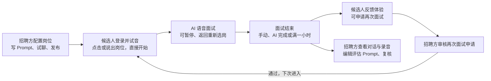
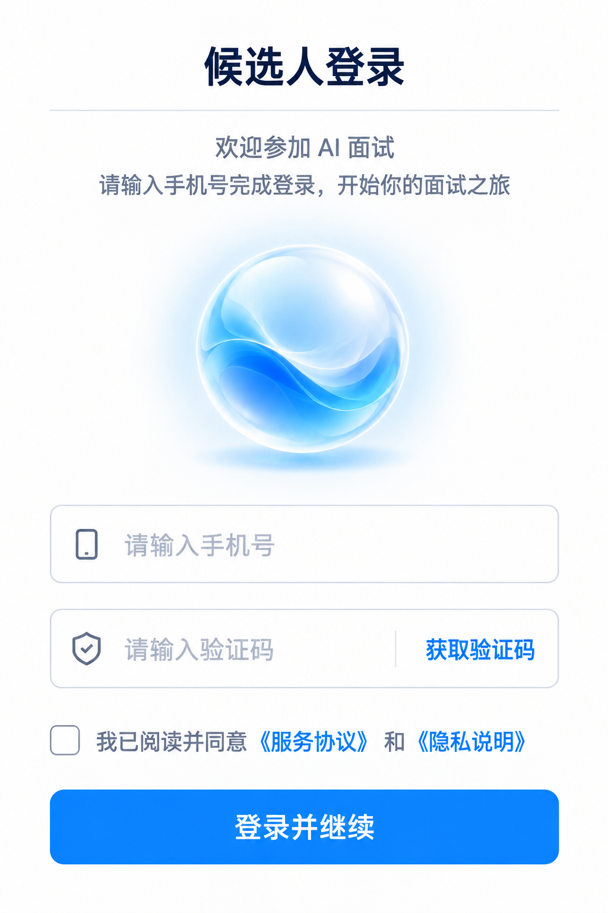
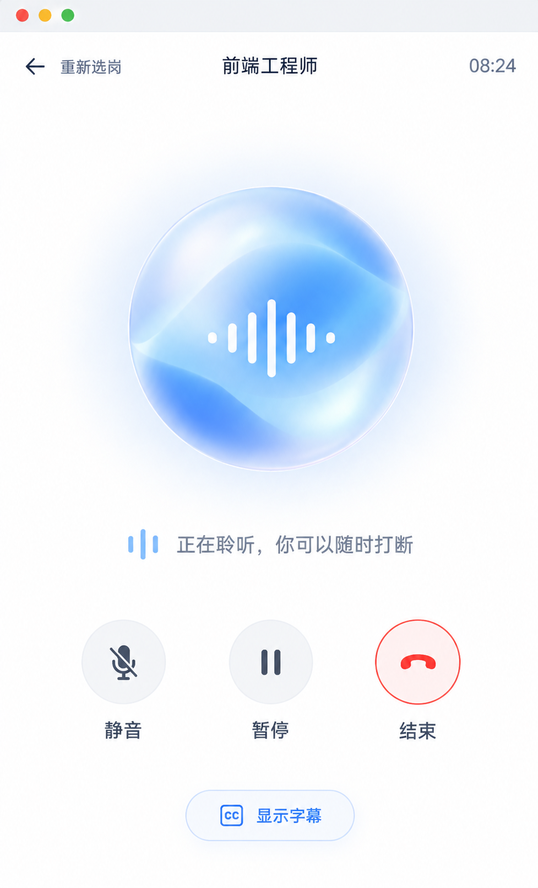
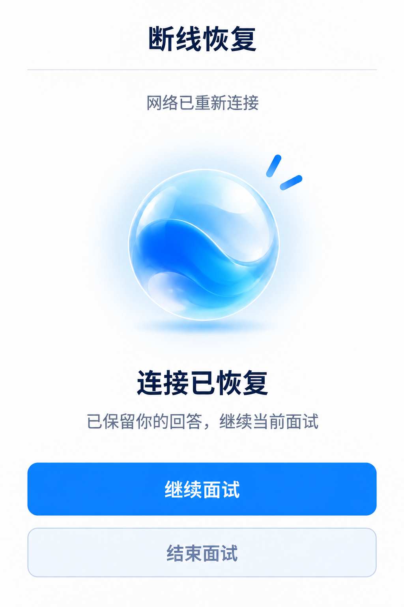
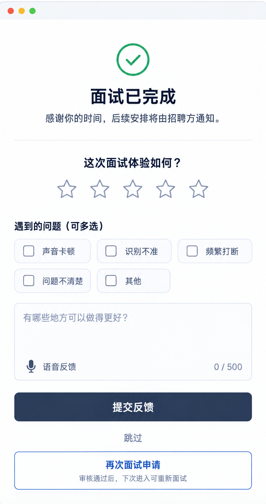
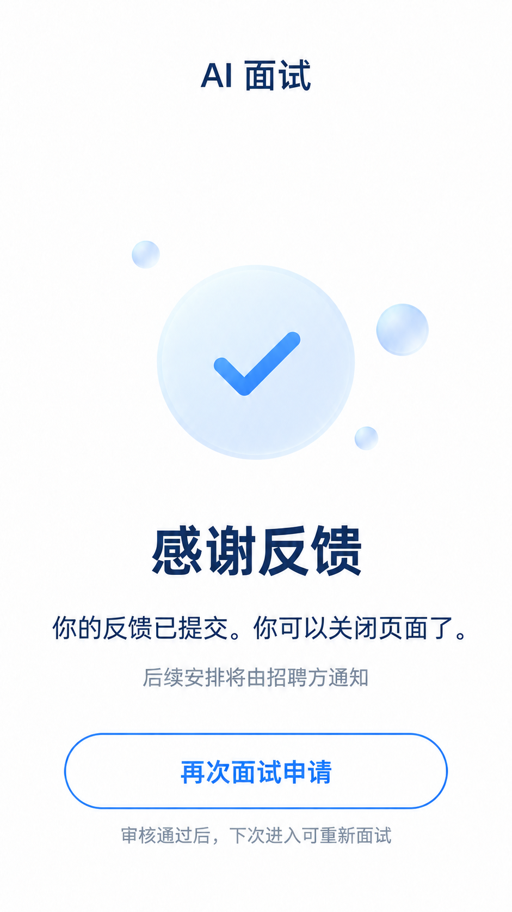
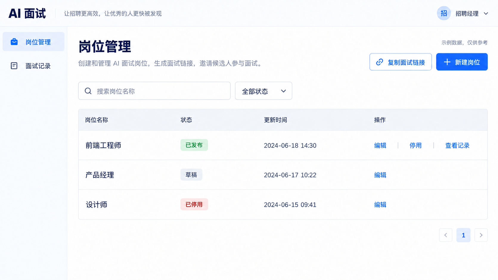
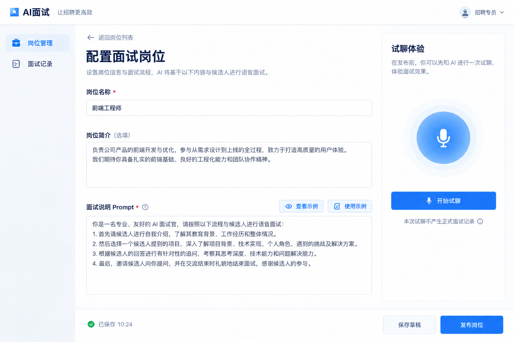
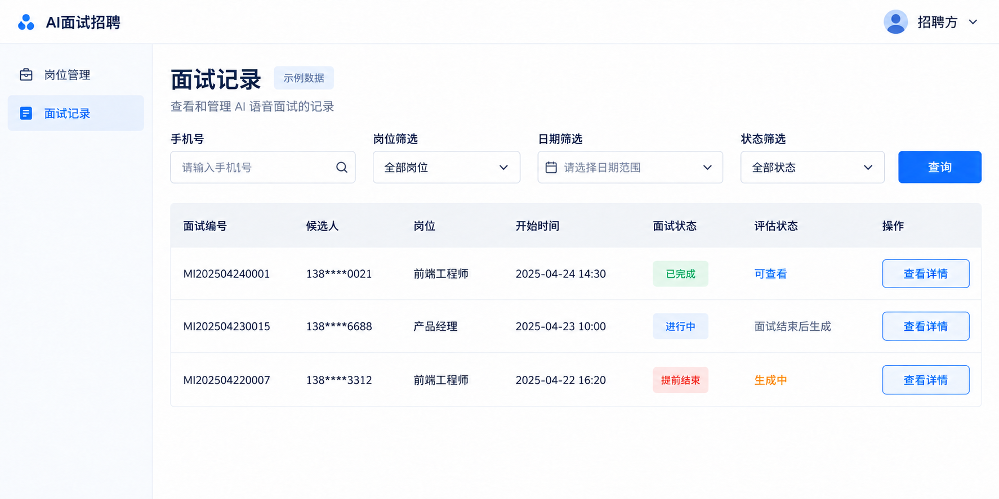
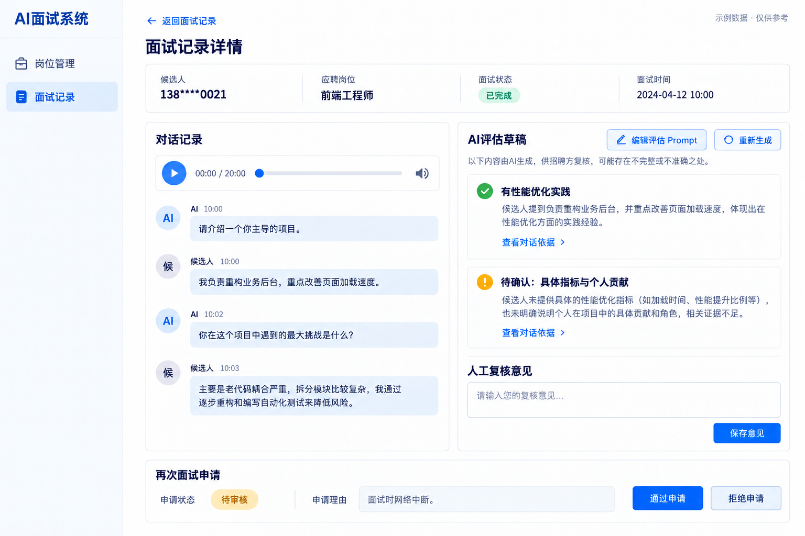

# 产品需求 · AI 语音面试 1.0

来源：https://5th-axiom.feishu.cn/wiki/Cis3waw05iIcyIkOulNcl92pnaf

同步日期：2026-09-10。保留在线表格合并关系、加粗状态和全部 11 张参考图。参考图与文字冲突时，以最新文字说明为准。

## 产品介绍

**一句话介绍：招聘方用一段岗位说明定义面试，候选人在网页中与 AI 语音交流，完成选岗、面试和体验反馈。**

## 核心链路

招聘方先定义“怎么面试”，候选人再通过对话完成面试。结束后，候选人反馈体验，招聘方查看面试记录。

<table>
<tr>
<th>用户</th>
<th>核心功能</th>
</tr>
<tr>
<td>招聘方</td>
<td>配置岗位、试聊发布、查看对话与<strong>录音</strong>、编辑评估 Prompt、复核及再次面试审核</td>
</tr>
<tr>
<td>候选人 </td>
<td>手机号登录、选岗即开始、语音面试、重新选岗、暂停或结束、反馈及再次面试申请</td>
</tr>
</table>

## 概念定义

<table>
<tr>
<th>概念</th>
<th>含义</th>
</tr>
<tr>
<td>招聘方</td>
<td>设置岗位和面试内容、查看候选人表现的人</td>
</tr>
<tr>
<td>候选人</td>
<td>打开面试链接，与 AI 交流的人</td>
</tr>
<tr>
<td>岗位 Prompt</td>
<td>招聘方写给 AI 的面试说明，例如问什么、如何追问、什么时候结束</td>
</tr>
<tr>
<td>发布岗位</td>
<td>让岗位可以被候选人选择；保存草稿还不代表发布</td>
</tr>
<tr>
<td>试聊</td>
<td>招聘方自己体验一次面试，用于检查 Prompt，不算正式面试</td>
</tr>
<tr>
<td>页面</td>
<td>用户完成一类事情的地方，例如语音面试页、反馈页</td>
</tr>
<tr>
<td>模块</td>
<td>页面中的一组相关功能，例如选择岗位、通话操作</td>
</tr>
<tr>
<td>页面状态</td>
<td>同一页面在不同时间显示的内容；选择岗位和正式面试是状态变化，不是两个页面</td>
</tr>
<tr>
<td>语音圆球</td>
<td>表示 AI 正在说话、聆听或思考的动态圆球，同时配有文字说明</td>
</tr>
<tr>
<td>字幕</td>
<td>当前 AI 说的话，可以显示或隐藏，不是完整聊天记录</td>
</tr>
<tr>
<td>面试记录</td>
<td>一次面试的岗位、时间、完成情况、对话文字和原始<strong>录音</strong></td>
</tr>
<tr>
<td>AI 评估草稿</td>
<td>AI 根据对话整理的观察，供招聘方复核，不代表录用结论</td>
</tr>
<tr>
<td>体验反馈</td>
<td>候选人对产品使用体验的评分和建议，不是候选人的面试成绩</td>
</tr>
<tr>
<td>评估 Prompt</td>
<td>招聘方写给 AI 的评估要求；在记录详情编辑，只影响本次<strong>草稿</strong>的重新生成。</td>
</tr>
<tr>
<td>再次面试申请</td>
<td>已结束面试的候选人申请新一轮；招聘方通过后，下次进入才可重新面试。</td>
</tr>
</table>

## 页面描述

### 4.1 页面总览

“上级页面”表示从哪里进入，“下级页面”表示可以继续去哪里

<table>
<tr>
<th><strong>页面分类</strong></th>
<th><strong>页面</strong></th>
<th><strong>一句话介绍</strong></th>
<th><strong>上级页面／入口</strong></th>
<th><strong>下级页面／去向</strong></th>
</tr>
<tr>
<td rowspan="3">候选人</td>
<td>登录页</td>
<td>用手机号验证码登录，继续面试</td>
<td>招聘方的面试链接</td>
<td>语音面试页</td>
</tr>
<tr>
<td>语音面试页</td>
<td>选好岗位，与 AI 语音面试</td>
<td>登录页；已登录的面试链接；恢复入口</td>
<td>面试反馈页</td>
</tr>
<tr>
<td>面试反馈页</td>
<td>反馈使用体验，或直接完成</td>
<td>语音面试结束后</td>
<td>原页完成提示；再次面试审核通过后进入语音面试页</td>
</tr>
<tr>
<td rowspan="4">招聘方</td>
<td>岗位列表页</td>
<td>管理岗位，复制面试入口</td>
<td>招聘方工作台；其他管理页</td>
<td>岗位配置页、面试记录列表页</td>
</tr>
<tr>
<td>岗位配置页</td>
<td>写 Prompt、试聊并发布岗位</td>
<td>岗位列表页新建或编辑</td>
<td>返回岗位列表页；原页试聊</td>
</tr>
<tr>
<td>面试记录列表页</td>
<td>找到一次面试，了解完成情况</td>
<td>招聘方导航；岗位列表；详情页返回</td>
<td>面试记录详情页、岗位列表页</td>
</tr>
<tr>
<td>面试记录详情页</td>
<td>看对话与<strong>录音</strong>、编辑评估和复核、审核再次面试申请</td>
<td>面试记录列表；有权限的记录链接</td>
<td>返回面试记录列表页</td>
</tr>
</table>

### 4.2 页面&模块

#### 4.2.1 候选人-登录页

用手机号验证码登录，登录后进入语音面试。

入口：招聘方的面试链接。登录后：首次或重试审核通过进入语音面试；未结束则显示继续入口；已结束则进入反馈页。已登录时直接判断去向。

<table>
<tr>
<th>模块</th>
<th>做什么</th>
</tr>
<tr>
<td>手机登录</td>
<td>用手机号和验证码登录</td>
</tr>
<tr>
<td>使用说明</td>
<td>阅读并同意使用与隐私说明</td>
</tr>
</table>

<table>
<tr>
<th>模块</th>
<th>截图示意（可选）</th>
<th>字段展示与操作按钮</th>
<th>备注 描述环境差异、功能本期实现</th>
</tr>
<tr>
<td rowspan="5">手机登录</td>
<td rowspan="7"></td>
<td>手机号：输入自己的手机号码。</td>
<td>测试环境不做手机号校验</td>
</tr>
<tr>
<td>获取验证码：点击发送短信，60 秒后可再次获取；发送失败可重试。</td>
<td></td>
</tr>
<tr>
<td>验证码：填写收到的短信验证码；错误或过期时提示重新获取。</td>
<td>测试环境的默认验证码是 123456</td>
</tr>
<tr>
<td>登录并继续：验证成功后进入语音面试页；首次登录自动创建账号；<strong>提交中</strong>不可重复点击。</td>
<td></td>
</tr>
<tr>
<td><strong>登录失败</strong>：保留手机号，提示检查验证码或重试。</td>
<td></td>
</tr>
<tr>
<td rowspan="2">使用说明</td>
<td>服务协议、隐私说明：点击查看使用和信息处理说明；关闭后保留已填内容。</td>
<td rowspan="2">这个暂时不做</td>
</tr>
<tr>
<td>同意协议：勾选后才能登录；默认不勾选。</td>
</tr>
</table>

#### 4.2.2 候选人-语音面试页

在同一页面选择岗位后直接与 AI 面试，也可返回重新选岗。

入口：登录成功、未结束面试恢复，或再次面试申请通过后重新进入。去向：手动结束、AI 完成或开始满一小时后进入反馈页。

<table>
<tr>
<th>模块</th>
<th>做什么</th>
</tr>
<tr>
<td>面试准备</td>
<td>阅读说明，开启麦克风并试音</td>
</tr>
<tr>
<td>选择岗位</td>
<td>说出或点击岗位，直接开始面试</td>
</tr>
<tr>
<td>面试</td>
<td>与 AI 对答，查看状态并控制通话</td>
</tr>
<tr>
<td>异常与恢复</td>
<td>没听清时重述，断线后继续</td>
</tr>
</table>

<table>
<tr>
<th><strong>模块</strong></th>
<th><strong>截图示意（可选）</strong></th>
<th><strong>字段展示与操作按钮</strong></th>
</tr>
<tr>
<td rowspan="3">面试准备</td>
<td rowspan="3"></td>
<td>面试说明：告知由 AI 面试、需要麦克风，以及面试记录用途。</td>
</tr>
<tr>
<td>开始对话：点击请求麦克风权限；允许后收起原说明和开始按钮，改为“请说一句话，测试麦克风”，圆球随声音变化。</td>
</tr>
<tr>
<td><strong>声音测试</strong>：<strong>检测到声音</strong>显示“测试成功”，自动替换为选岗内容；<strong>未检测到声音</strong>显示“没有听到声音”和“重新测试”；<strong>权限被拒绝</strong>提示开启麦克风权限，点击“重试”后再检测。</td>
</tr>
<tr>
<td rowspan="4">选择岗位</td>
<td rowspan="4"></td>
<td>标题：你想面试哪个岗位？</td>
</tr>
<tr>
<td>岗位按钮：只展示<strong>已发布</strong>岗位；点击后收起岗位列表，显示所选岗位和通话操作，AI 直接开场，无需再次确认。</td>
</tr>
<tr>
<td><strong>麦克风状态</strong>：<strong>未讲话</strong>显示“<strong>请说出想面试的岗位</strong>”；<strong>讲话时</strong>显示“<strong>正在聆听</strong>”；<strong>AI 播报时</strong>显示“<strong>AI 正在说话</strong>”。</td>
</tr>
<tr>
<td>语音选岗：明确说出岗位后直接开始；没听清或无法确定岗位时继续询问，不擅自选岗。</td>
</tr>
<tr>
<td rowspan="8">面试</td>
<td rowspan="8"></td>
<td>岗位名称与返回图标：显示当前岗位；点击返回上一步，停止当前语音并重新展示岗位列表；选好后按新岗位重新开场。已有对话按岗位保留，一小时截止时间不重置。</td>
</tr>
<tr>
<td>面试时长：显示有效对话时长 00:00，暂停和重连不累计；正式开始满一小时自动结束，暂停、退出和换岗不延长截止时间。</td>
</tr>
<tr>
<td>当前问题：开启字幕后显示 AI 当前话语，回答时保留；字幕默认<strong>隐藏</strong>。</td>
</tr>
<tr>
<td><strong>圆球与提示</strong>：显示“<strong>AI 正在说话</strong>”“<strong>正在聆听</strong>”或“<strong>正在思考</strong>”；可开口打断、要求重复或解释。</td>
</tr>
<tr>
<td><strong>静音／取消静音</strong>：关闭或恢复麦克风；<strong>静音</strong>时显示“<strong>麦克风已静音</strong>”，仍能听到 AI。</td>
</tr>
<tr>
<td><strong>暂停／继续</strong>：暂停双方语音，继续时接上当前问题；保留静音设置。</td>
</tr>
<tr>
<td><strong>结束方式</strong>：<strong>手动结束</strong>需确认，取消则继续；<strong>AI 判断完成</strong>时收尾后结束；<strong>开始满一小时</strong>自动结束。三种情况均停止语音、保存记录并进入反馈页。</td>
</tr>
<tr>
<td><strong>字幕状态</strong>：默认<strong>隐藏</strong>，点击“显示字幕”后变为<strong>显示</strong>；点击“隐藏字幕”可收起，不影响语音。</td>
</tr>
<tr>
<td rowspan="4">异常与恢复</td>
<td rowspan="4"></td>
<td>展示时机：仅在<strong>面试中断网</strong>或<strong>退出后重新进入</strong>时出现恢复提示，替换当前问题；正常停顿只由 AI 温和提醒，不显示断线提示。</td>
</tr>
<tr>
<td><strong>面试中断网</strong>：显示“<strong>正在重连</strong>”，停止收音和播报并保留回答；恢复后显示“<strong>连接已恢复</strong>”和“继续面试”，点击后接上当前问题。</td>
</tr>
<tr>
<td><strong>退出后重新进入</strong>：登录后有未结束面试且未到一小时截止时间，显示原岗位、“你有一场未完成的面试”和“继续面试”；点击后请求麦克风权限并接上原对话。</td>
</tr>
<tr>
<td><strong>重连失败</strong>可点“重试”或确认结束；<strong>已结束</strong>或<strong>已满一小时</strong>不再显示继续入口，直接进入反馈页。退出期间达到截止时间也自动结束。</td>
</tr>
</table>

面试不显示阶段进度；字幕默认隐藏，返回图标可重新选岗。

#### 4.2.3 候选人-面试反馈页

面试结束后反馈体验，也可申请再次面试。

入口：手动确认结束、AI 判断完成或正式开始满一小时后自动进入；已结束面试再次打开也进入本页。去向：提交或跳过后显示完成提示；再次面试申请通过后，下次进入语音面试页。

<table>
<tr>
<th>模块</th>
<th>做什么</th>
</tr>
<tr>
<td>面试反馈</td>
<td>评分、选问题，补充文字或语音</td>
</tr>
<tr>
<td>提交与完成</td>
<td>提交或跳过，查看完成提示</td>
</tr>
<tr>
<td>再次面试申请</td>
<td>申请新一轮面试，查看审核状态</td>
</tr>
</table>

<table>
<tr>
<th><strong>模块</strong></th>
<th><strong>截图示意（可选）</strong></th>
<th><strong>字段展示与操作按钮</strong></th>
</tr>
<tr>
<td rowspan="8">面试反馈</td>
<td rowspan="8"></td>
<td><strong>结束标题</strong>：<strong>AI 判断完成</strong>显示“面试已完成”；<strong>手动结束</strong>显示“本次面试已结束”；<strong>满一小时</strong>显示“面试时间已到，本次面试已结束”。均停止面试录音。</td>
</tr>
<tr>
<td>后续说明：感谢你的时间，后续安排将由招聘方通知。</td>
</tr>
<tr>
<td><strong>体验评分</strong>：可选 <strong>1 星</strong>、<strong>2 星</strong>、<strong>3 星</strong>、<strong>4 星</strong>、<strong>5 星</strong>，可修改；选填，仅评价体验。</td>
</tr>
<tr>
<td><strong>问题标签</strong>：<strong>声音卡顿</strong>、<strong>识别不准</strong>、<strong>频繁打断</strong>、<strong>问题不清楚</strong>、<strong>其他</strong>；可多选，再点取消。</td>
</tr>
<tr>
<td>补充说明：填写遇到的问题或建议，最多 500 字；显示已输入字数。</td>
</tr>
<tr>
<td>语音输入：点击开始<strong>录音</strong>，可停止或取消；用户主动开启，不自动<strong>录音</strong>。</td>
</tr>
<tr>
<td>语音转文字：停止后<strong>转写</strong>，允许修改后提交；失败保留已有文字，可重试或打字。</td>
</tr>
<tr>
<td>字数提示：内容超出 500 字时提示精简；不直接截掉反馈内容。</td>
</tr>
<tr>
<td rowspan="4">提交与完成</td>
<td rowspan="7"></td>
<td>提交反馈：至少填写一项后提交，成功显示“感谢反馈，你可以关闭页面了”；<strong>录音</strong>、<strong>转写</strong>和<strong>提交中</strong>不能重复提交。</td>
</tr>
<tr>
<td><strong>提交失败</strong>：保留全部内容，提示重试。</td>
</tr>
<tr>
<td>跳过：不提交反馈，显示“本次面试已结束，你可以关闭页面了”；已有内容或正在<strong>录音</strong>时，先确认<strong>放弃</strong>。</td>
</tr>
<tr>
<td>完成提示：提交或跳过后可关闭页面，仍可申请再次面试；刷新不重复提交，只有审核通过后才可开始新一轮。</td>
</tr>
<tr>
<td rowspan="3">再次面试申请</td>
<td>再次面试申请：反馈页及完成提示中均可点击；填写申请原因（选填），提交后保留当前反馈，不自动开始面试。</td>
</tr>
<tr>
<td><strong>申请状态</strong>：<strong>未申请</strong>可提交；<strong>待审核</strong>不可重复提交；<strong>已通过</strong>提示“下次进入可重新面试”；<strong>未通过</strong>显示原因，可修改后再次申请；提交失败可重试。</td>
</tr>
<tr>
<td>再次进入：审核通过后，用同一账号打开面试链接，进入选岗并开始新一轮；新一轮单独计时，原记录保留，一次通过仅可开启一轮。</td>
</tr>
</table>

#### 4.2.4 招聘方-岗位列表页

管理面试岗位，把面试链接提供给候选人。

入口：招聘方工作台或岗位配置页返回。去向：岗位配置页、面试记录列表页；候选人入口在新标签页打开。

<table>
<tr>
<th>模块</th>
<th>做什么</th>
</tr>
<tr>
<td>查找岗位</td>
<td>按名称和状态找到岗位</td>
</tr>
<tr>
<td>岗位列表</td>
<td>查看岗位信息和发布情况</td>
</tr>
<tr>
<td>岗位操作</td>
<td>新建、编辑、停用或查看记录</td>
</tr>
<tr>
<td>面试入口</td>
<td>复制或打开候选人链接</td>
</tr>
</table>

<table>
<tr>
<th>模块</th>
<th>截图示意（可选）</th>
<th>字段展示与操作按钮</th>
</tr>
<tr>
<td rowspan="2">查找岗位</td>
<td rowspan="11"></td>
<td>搜索：输入岗位名称查找；无结果时可清空条件。</td>
</tr>
<tr>
<td><strong>状态筛选</strong>：查看<strong>草稿</strong>、<strong>已发布</strong>或<strong>已停用</strong>岗位。</td>
</tr>
<tr>
<td rowspan="3">岗位列表</td>
<td>岗位信息：显示名称、状态和最近更新时间；点击名称进入配置页。</td>
</tr>
<tr>
<td>暂无岗位：提示先创建一个岗位；提供“新建岗位”按钮。</td>
</tr>
<tr>
<td><strong>加载失败</strong>：说明读取失败，点击重试；保留筛选条件。</td>
</tr>
<tr>
<td rowspan="4">岗位操作</td>
<td>新建岗位：进入空白配置页。</td>
</tr>
<tr>
<td>编辑岗位：查看并修改岗位信息和 Prompt；修改后需重新发布才影响新面试。</td>
</tr>
<tr>
<td>停用岗位：确认后不再接收新面试；已经开始的面试继续。</td>
</tr>
<tr>
<td>查看记录：进入面试记录列表；自动筛选当前岗位。</td>
</tr>
<tr>
<td rowspan="2">面试入口</td>
<td>复制面试链接：复制候选人的通用入口，提示已复制；复制失败时可手动复制。</td>
</tr>
<tr>
<td>查看入口：打开候选人登录或语音面试页；要测试面试请使用配置页的试聊。</td>
</tr>
</table>

#### 4.2.5 招聘方-岗位配置页

写清岗位和面试要求，试聊满意后发布。

入口：岗位列表页的新建或编辑。去向：返回岗位列表；试聊在本页打开并关闭。

<table>
<tr>
<th>模块</th>
<th>做什么</th>
</tr>
<tr>
<td>岗位信息</td>
<td>填写名称和简介</td>
</tr>
<tr>
<td>面试 Prompt</td>
<td>定义提问、追问和结束方式</td>
</tr>
<tr>
<td>试聊</td>
<td>体验当前配置的面试</td>
</tr>
<tr>
<td>保存与发布</td>
<td>保存草稿或对候选人开放</td>
</tr>
</table>

<table>
<tr>
<th>模块</th>
<th>截图示意（可选）</th>
<th>字段展示与操作按钮</th>
</tr>
<tr>
<td rowspan="3">岗位信息</td>
<td rowspan="14"></td>
<td>岗位名称：填写候选人看到的岗位名称；必填。</td>
</tr>
<tr>
<td>岗位简介：简要说明工作内容，帮助 AI 介绍岗位；选填。</td>
</tr>
<tr>
<td><strong>发布状态</strong>：显示<strong>草稿</strong>、<strong>已发布</strong>或<strong>已停用</strong>；有未发布修改时单独提示。</td>
</tr>
<tr>
<td rowspan="4">面试 Prompt</td>
<td>面试说明：填写问什么、怎么追问、何时结束；必填，各岗位独立设置。</td>
</tr>
<tr>
<td>查看示例：打开可参考的面试说明；不自动覆盖已有内容。</td>
</tr>
<tr>
<td>使用示例：把示例填入编辑框；已有内容时先确认替换。</td>
</tr>
<tr>
<td><strong>保存提示</strong>：<strong>未保存</strong>、<strong>保存中</strong>、<strong>已保存</strong>、<strong>保存失败</strong>；失败保留内容。</td>
</tr>
<tr>
<td rowspan="3">试聊</td>
<td>开始试聊：用当前填写的内容体验面试；先补齐必填项，无需发布。</td>
</tr>
<tr>
<td>试聊模式：已选定当前岗位，直接与 AI 交流；不产生候选人正式记录。</td>
</tr>
<tr>
<td>结束试聊：返回配置，继续修改；不进入候选人反馈页。</td>
</tr>
<tr>
<td rowspan="4">保存与发布</td>
<td>保存<strong>草稿</strong>：保存当前内容，显示保存时间；不改变候选人正在使用的内容。</td>
</tr>
<tr>
<td>发布岗位：必填项完整后发布，候选人即可选择；重新发布只影响新面试。</td>
</tr>
<tr>
<td><strong>发布失败</strong>：保留内容，提示重试；已有发布版本继续可用。</td>
</tr>
<tr>
<td>返回列表：回到岗位列表页；<strong>未保存</strong>时询问<strong>保存后离开</strong>或<strong>放弃</strong>。</td>
</tr>
</table>

#### 4.2.6 招聘方-面试记录列表页

查找候选人的面试记录，了解完成情况。

入口：招聘方导航、岗位列表或详情页返回。去向：面试记录详情页；可切回岗位列表。

<table>
<tr>
<th>模块</th>
<th>做什么</th>
</tr>
<tr>
<td>查找记录</td>
<td>按候选人、岗位、日期和状态查找</td>
</tr>
<tr>
<td>记录列表</td>
<td>查看记录并进入详情</td>
</tr>
</table>

<table>
<tr>
<th>模块</th>
<th>截图示意（可选）</th>
<th>字段展示与操作按钮</th>
</tr>
<tr>
<td rowspan="3">查找记录</td>
<td rowspan="9"></td>
<td>候选人搜索：按手机号查找面试；列表仅展示脱敏手机号。</td>
</tr>
<tr>
<td>岗位与日期：按岗位和面试开始时间筛选；可清空筛选。</td>
</tr>
<tr>
<td><strong>状态筛选</strong>：<strong>进行中</strong>、<strong>已完成</strong>、<strong>提前结束</strong>、<strong>超时结束</strong>、<strong>异常中断</strong>；短暂断网不算最终中断。</td>
</tr>
<tr>
<td rowspan="6">记录列表</td>
<td>面试信息：显示面试编号、候选人、岗位和开始时间。 再次面试申请：有待审核申请的记录显示“待审核”标记，点击进入详情处理。</td>
</tr>
<tr>
<td><strong>面试状态</strong>：<strong>进行中</strong>、<strong>已完成</strong>、<strong>提前结束</strong>、<strong>超时结束</strong>、<strong>异常中断</strong>；按结束原因显示，试聊不计入正式记录。</td>
</tr>
<tr>
<td><strong>评估状态</strong>：<strong>待生成</strong>、<strong>生成中</strong>、<strong>可查看</strong>、<strong>生成失败</strong>；面试未结束时显示“<strong>面试结束后生成</strong>”。</td>
</tr>
<tr>
<td>查看详情：打开本次对话和评估；返回后保留筛选条件。</td>
</tr>
<tr>
<td>暂无记录：说明没有面试或没有匹配结果；提供清空筛选入口。</td>
</tr>
<tr>
<td><strong>加载失败</strong>：保留筛选，点击重新加载。</td>
</tr>
</table>

#### 4.2.7 招聘方-面试记录详情页

阅读对话和 AI 观察，写下招聘方自己的判断。

入口：面试记录列表或有权限的记录链接。去向：返回列表并保留筛选；评估 Prompt 编辑和再次面试审核在本页完成。

<table>
<tr>
<th>模块</th>
<th>做什么</th>
</tr>
<tr>
<td>面试概览</td>
<td>了解本次面试的基本情况</td>
</tr>
<tr>
<td>对话记录</td>
<td>阅读对话并播放原始<strong>录音</strong></td>
</tr>
<tr>
<td>AI 评估草稿</td>
<td>查看观察与依据，编辑评估 Prompt</td>
</tr>
<tr>
<td>人工复核</td>
<td>保存招聘方的判断</td>
</tr>
<tr>
<td>再次面试审核</td>
<td>查看申请，通过或拒绝</td>
</tr>
</table>

<table>
<tr>
<th>模块</th>
<th>截图示意（可选）</th>
<th>字段展示与操作按钮</th>
</tr>
<tr>
<td rowspan="3">面试概览</td>
<td rowspan="15"></td>
<td>基本信息：显示编号、候选人、岗位、时间和结束情况；候选人手机号脱敏显示。</td>
</tr>
<tr>
<td>返回列表：回到刚才的记录列表；保留原筛选。</td>
</tr>
<tr>
<td>无法查看：说明记录不存在或没有权限；不展示记录正文。</td>
</tr>
<tr>
<td rowspan="3">对话记录</td>
<td>对话内容：按顺序展示 AI 和候选人的文字。</td>
</tr>
<tr>
<td>原始录音：点击<strong>播放／暂停</strong>，显示已播时间和总时长，可拖动定位；录音<strong>处理中</strong>显示等待提示，<strong>缺失</strong>如实说明，<strong>加载失败</strong>可重试。</td>
</tr>
<tr>
<td>缺失与重试：未识别的文字或缺失<strong>录音</strong>如实标记，不补造；读取失败可重新加载，保留已显示内容。</td>
</tr>
<tr>
<td rowspan="3">AI 评估草稿</td>
<td>评估说明：展示能力观察和需要进一步确认的地方；供招聘方复核，不是录用决定。 编辑评估 Prompt：点击打开本次评估说明，可修改考察维度、判断依据和输出要求；不可为空，取消则放弃修改。 保存 Prompt：仅保存本次评估设置，不改原始对话或其他面试；失败保留输入。点击“重新生成”并确认后，按新 Prompt 更新本次草稿，人工复核意见保留；生成失败保留旧草稿。</td>
</tr>
<tr>
<td>对话依据：点击定位到支持这条观察的回答；信息不足时标记“<strong>证据不足</strong>”。</td>
</tr>
<tr>
<td><strong>生成提示</strong>：面试结束后生成，显示<strong>生成中</strong>、<strong>可查看</strong>或<strong>生成失败</strong>；失败可重试。</td>
</tr>
<tr>
<td rowspan="3">人工复核</td>
<td>复核意见：填写招聘方自己的判断；与 AI <strong>草稿</strong>分开保存。</td>
</tr>
<tr>
<td>保存意见：点击保存，成功后显示<strong>已保存</strong>；失败保留内容并允许重试。</td>
</tr>
<tr>
<td>离开提醒：<strong>未保存</strong>时提醒<strong>继续编辑</strong>或<strong>放弃修改</strong>；体验反馈不进入能力评估。</td>
</tr>
<tr>
<td rowspan="3">再次面试审核</td>
<td>申请信息：显示申请时间、原因和<strong>待审核／已通过／未通过</strong>状态；没有申请时显示“暂无申请”。</td>
</tr>
<tr>
<td>通过申请：确认后允许候选人下次进入时开始新一轮，原记录保留；同一申请只处理一次。</td>
</tr>
<tr>
<td>拒绝申请：填写原因并确认，候选人可在反馈页查看；操作失败保留输入并可重试。</td>
</tr>
</table>
