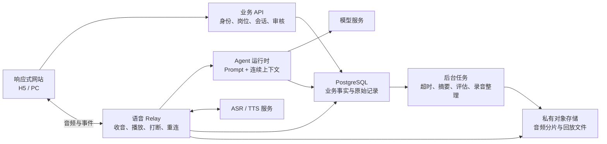
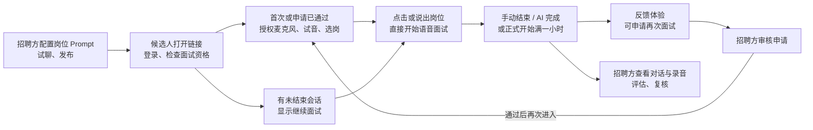
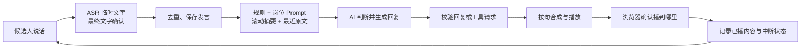
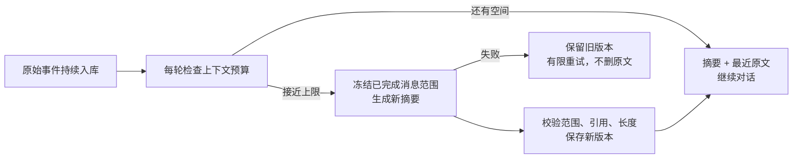

# AI 语音面试 1.0 技术方案

一套同时适配 H5 和 PC 的响应式网站：招聘方用 Prompt 定义面试，候选人在一个连续对话中完成选岗与面试，结束后反馈，招聘方查看文字、录音和 AI 评估。

本方案按最新 PRD 设计，覆盖候选人和招聘方完整链路。本文中的技术选型、接口名、表名和性能目标是本项目的实施建议；参考项目中已核对的代码机制会单独指出，不把参考代码等同于本项目已经实现。

## 2026-09-11 已实现的语音管线补充

最新实现增加显式轮次协调器、控制/ASR/对象存储分离队列、助手 PCM 事务 outbox、源连接签名播放回执、逐片转写覆盖和跨组件补传。后台归档按字节偏移读取；Worker 遵循 sessions → jobs → 业务对象锁顺序，失租执行者不能提交。

上下文使用实际播放及输入修订投影，Token 预算覆盖规则/工具/输出预留，长回答摘要在后台缓存；模型按实时/摘要/评估分用途配置。协议、开关、Prompt 与实时模型配置按会话冻结。新增迁移 `005_voice_runtime.sql`，部署顺序和回滚约束见 [整体改造报告](remediation-report.md)。本节更新实际实现；本文原有性能数字仍是目标。

## 先解释几个概念

| 概念 | 白话说明 |
| --- | --- |
| Prompt | 写给 AI 的工作说明，决定怎么选岗、提问、追问和收尾。 |
| 模型 / LLM | 阅读上下文并生成回复的 AI；通过统一接口接入，可替换供应商。 |
| 工具调用 | AI 发出结构化的操作请求，如选择某个岗位、结束面试；服务端校验后才执行。 |
| 上下文 | AI 这次回复前能看到的信息，包括规则、已知事实和最近对话。 |
| 滚动压缩 | 对话太长时，把较早内容整理成摘要，给最近对话留空间；原始记录仍完整保存。 |
| Token | 有两个不同意思：模型 Token 是文字长度计量；设计 Token 是颜色、间距等统一样式变量。 |
| ASR / TTS | ASR 把声音变成文字；TTS 把 AI 的文字变成声音。 |
| VAD / 打断 | VAD 判断是否有人说话；打断是候选人开口后及时停掉 AI 的播报。 |
| 语音 Relay | 浏览器与语音供应商之间的中转服务，负责音频、连接、取消和事件顺序。 |
| WebSocket | 浏览器和服务端持续保持的一条双向连接，用来传音频和即时状态。 |
| 会话 / 轮次 | 一场面试叫会话；其中一次候选人发言和 AI 回复叫一个对话轮次。申请通过后的再次面试是新会话。 |
| 岗位片段 | 同一会话中，选中某个岗位后的一段交流。换岗增加新片段，但不断开整场会话的逻辑上下文。 |
| 幂等 | 同一个请求重复到达，也只产生一次结果，例如不会重复创建面试或通过两次申请。 |
| 版本快照 | 开始面试时记住所用 Prompt 的具体版本；后续改稿不影响进行中的面试。 |
| 事务 / 后台任务 | 事务让相关数据一起成功或失败；后台任务处理评估、录音整理、超时结束等不必让页面等待的工作。 |
| 流式 / 首包 | 内容生成一部分就往下传；首包是第一段可用内容，收到首字不等于用户已经听到声音。 |
| 连接代次 / 回复编号 | 标记当前连接和当前回复，打断或重连后可识别并丢弃旧结果。 |
| 待发送队列 | 网络来不及发送的音频暂存区；必须限制大小，积压过多就暂停并提示，不能一直占内存。 |

## 分层架构

### 整体选择

前端建议用 React + TypeScript + Next.js，沿用 aural-oss 的技术生态，候选人和招聘方共用一套工程。Next.js 负责网页和普通接口；语音连接放在独立常驻 Node.js 进程；后台任务单独运行。数据库用 PostgreSQL，录音放私有对象存储。

这是三个运行入口、共享一套业务模块，不在 1.0 拆成大量微服务。运行版本以实施时验证并锁定的依赖为准，不直接照搬参考项目的版本号。

| 层 | 负责什么 | 边界 |
| --- | --- | --- |
| 页面与组件 | 展示内容、采集点击、显示语音状态 | 不自行决定下一题，不在按钮里拼模型 Prompt。 |
| 前端交互逻辑 | 用页面内的 Hook 管试音、选岗、暂停和恢复 | 不作为会话状态、权限和截止时间的最终依据。 |
| 业务 API | 账号、岗位发布、会话准入、反馈、审核、复核 | 校验并保存事实，不写逐题追问规则。 |
| Agent 运行时 | 装配 Prompt、管理单一上下文、调用模型与工具 | 不直接操作页面，不自行绕过权限或修改录音。 |
| 语音 Relay | ASR、TTS、播放确认、取消、音频顺序 | 不决定面试题目和追问深度。 |
| 数据与后台任务 | 可靠保存、恢复、超时结束、摘要和评估 | 可重试、可追踪，不依赖网页一直开着。 |

### Prompt 和工程各做什么

| 交给 Prompt | 工程必须保证 |
| --- | --- |
| 理解岗位意向，意向不清时询问 | 工具里的岗位 ID 必须存在、已发布且属于当前招聘入口。 |
| 按岗位要求提问、追问、解释、避免重复 | 保留真实对话，校验输出结构、取消旧回复、有限重试。 |
| 判断内容是否已覆盖、是否自然收尾 | 校验结束请求；手动结束、满一小时、权限检查不能交给模型。 |
| 总结较早对话，记录待追问事项 | 控制上下文预算，校验摘要范围和引用，防止丢消息。 |
| 根据评估 Prompt 给出观察和证据 | 校验引用是否真实存在；保留版本，人工复核独立保存。 |

不引入固定题目表、题号游标或代码里的“回答短于几字就追问”。工程保留的是连接、权限、计时和数据状态机，这些是让 Prompt 能可靠工作的必要底座。

### 参考项目的取舍

| 参考 | 本项目采用 | 需要改造 |
| --- | --- | --- |
| alice-a2a | 原始值 → 语义 Token → 组件的样式结构；统一组件目录、主题配置与校验 | Web 只保留 Foundations、基础组件、业务组件、页面四层。品牌多主题是本项目扩展，不照搬 Flutter 的层级。 |
| aural-oss 语音链路 | 麦克风分帧、ASR 临时结果与最终结果区分、播放缓冲、打断取消、过期回调隔离、播放完成确认、重连 | 不复制整份大型 use-voice / voice-relay 文件；抽取小模块并迁移相关测试。 |
| aural-oss 对话组织 | 可以借鉴已有内容摘要和避免重复的经验 | 当前代码按 questionTranscript 和题目序号推进，切题清空本题记录并保留题目摘要；本项目替换为整场连续上下文。 |
| aural-oss 采音 | 保留回声消除、降噪和固定大小分帧 | 当前代码使用 createScriptProcessor，新实现改为 AudioWorklet，并校验实际采样率、补齐重采样；前者已废弃。[MDN 说明](https://developer.mozilla.org/en-US/docs/Web/API/ScriptProcessorNode) |

## 流程链路

### 候选人和招聘方如何串起来

登录后的分流由服务端返回：**可开始、可恢复、已结束、申请待审核、申请未通过**。已结束且没有可用审核资格时仍显示反馈与申请；申请通过只在创建新会话成功的同一事务中消费，刷新或多开页面不能重复使用。

### 一次自然对答

临时 ASR 文字只用于即时状态和打断，不直接当成最终回答；最终结果按发言 ID 更新、去重后才触发一轮推理。用户说了两次相同的话仍是两次真实发言，不能只按文本内容去重。

供应商的一次“识别完成”不一定表示用户已经说完。保留短暂停顿的合并窗口，用户继续讲话就延后提交；窗口从最近一次有效声音或新增识别文字计算，不能因这轮回答很长就提前抢话。页面收到服务端确认开始推理后才显示思考，正常停顿不显示断线。

### 网络中断和中途退出

| 场景 | 页面体验 | 服务端处理 |
| --- | --- | --- |
| 面试中断网 | 停止收音与播放，显示正在重连；连上后等用户点继续 | 旧连接失效，保存已确认记录；新连接取得最新快照和新连接代次。 |
| 退出后再次进入 | 显示原岗位和继续面试；点击后重新检查麦克风 | 按登录账号找未结束会话，加载同一个逻辑上下文，不从第一题重来。 |
| 恢复时已超过一小时 | 直接进入反馈页 | 先将到期会话结束，再返回结果；不能先恢复后补做超时。 |
| 只说了半句就断开 | 提示最后一句可能未保存，请重述 | 有持久化音频可补转写；没有接收或确认的内容标记缺失，不伪造。 |
| 同时打开两个页面 | 提示已有页面正在面试，可显式接管 | 同一会话只允许一个有效语音连接；接管递增连接代次，旧连接立即失效。 |

### 暂停、换岗和结束

静音只关闭候选人上行声音；暂停同时停止收音、模型生成和播报。继续时保留原静音设置，并把“暂停后恢复”作为事件交给 AI 接话。

返回上一步立即取消旧回复并回到选岗。重新选择后新增岗位片段，换成新岗位的 Prompt，历史片段仍留在同一个上下文中并明确标注旧岗位。AI 按新岗位重新开场；首次正式开始时间和一小时截止时间不变。

**有效面试时长**由服务端累加有效连接且未暂停的时段，静音仍计时；断线和选岗准备不计入。**截止时间**固定为首次正式开始时间加一小时，与页面上显示的有效时长分开保存。

手动确认结束直接提交结束指令。AI 自然完成时先进入收尾，结束语播完后结束；收尾中被打断则取消待结束动作、继续听，直到 AI 再次明确收尾。收尾等待设置有限超时，避免 TTS 故障卡住。到达一小时则立即由服务端结束，不等待模型或播放完成。

## 前端实现

### 一套网站，两种屏幕

采用同一路由、同一套交互逻辑和同一组组件，H5 与 PC 只改变排列方式。不要复制 mobile 和 desktop 两套页面逻辑，也不要把 PC 页面整体等比缩小。

| 页面与建议路由 | 页面负责的交互 | 主要组件 |
| --- | --- | --- |
| 登录 /interview/login | 手机号、验证码、环境提示、登录后分流 | PhoneLoginForm、AsyncFeedback |
| 语音面试 /interview/session/:id | 准备、试音、选岗、对话、暂停、恢复 | VoiceOrb、RolePicker、VoiceControls、ResumePrompt |
| 面试反馈 /interview/session/:id/feedback | 评分、问题、文字或语音反馈、再次申请 | FeedbackForm、RetryApplicationPanel |
| 岗位列表 /admin/roles | 搜索、筛选、新建、停用、复制入口 | FilterBar、RoleList、StatusTag |
| 岗位配置 /admin/roles/:id | 编辑 Prompt、保存、发布、试聊 | RoleForm、PromptEditor、PreviewSession |
| 记录列表 /admin/interviews | 筛选记录、定位待审核申请 | InterviewList、FilterBar |
| 记录详情 /admin/interviews/:id | 原文、录音、评估编辑、复核、审核 | TranscriptViewer、AudioPlayer、AssessmentPanel、ReviewForm |

路由名称是工程建议，不增加 PRD 页面。新建岗位可用 /admin/roles/new；试聊在配置页内打开，不创建正式候选人记录。

### 从样式底座到页面

| 层 | 放什么 | 约束 |
| --- | --- | --- |
| Foundations | Token、Theme、断点、字体、动效 | 不依赖页面，不读取面试业务数据。 |
| 基础组件 | Button、Input、Dialog、FormField、Tag、AudioPlayer | 通用展示和操作；统一禁用、焦点和键盘行为，不请求业务数据。 |
| 业务组件 | VoiceOrb、RolePicker、VoiceControls、AssessmentPanel | 组合基础组件，接收数据和操作回调，表达面试功能。 |
| 页面 | 登录、语音面试、反馈、岗位和记录管理 | 装配组件，用 Hook 管状态，调用 API 读写数据。 |

前端就这四层：页面组合业务组件，业务组件复用基础组件，样式统一来自 Foundations。页面外壳按需做普通布局组件；复杂交互放 useVoiceSession 等 Hook，请求放同模块 api.ts，不再单独建立 Controller、UseCase、Port、Adapter 层。

圆球只消费**聆听、思考、播报、暂停、重连**及音量数据。动画不能决定对话状态；音量变化节流后更新，音频帧处理不触发整页重渲染。

### Token 和多主题配置

建议目录：design-system/tokens/primitives.json 存原始值；themes/<themeId>/<light-or-dark>.json 把语义名称映射为值；构建时生成 CSS Variables 和 TypeScript 类型。组件只使用 --color-bg-canvas、--color-text-primary、--color-action-primary、--space-4 等语义变量。

| 配置项 | 实现方式 |
| --- | --- |
| 原始 Token | 颜色、间距、字号、圆角、阴影、动效都有有限阶梯；页面不散写色值。 |
| 语义 Token | 背景、主要文字、边框、操作色、危险状态、焦点等，在每个主题中完整定义。 |
| 组件 Token | 例如按钮高度、圆球渐变，引用语义 Token；不按使用页面建立特殊颜色分支。 |
| 主题配置 | themeId + appearance（light / dark）+ version，由 App Shell 一次加载；候选人与招聘方共享解析规则。 |
| 缺失或错误 | 配置校验失败回退默认主题，页面仍可操作；主题切换不重建 AudioContext 或断开连接。 |
| 可扩展范围 | 1.0 提供默认浅色和深色完整主题，允许后续增加品牌主题文件；不在本期额外建设可视化主题编辑器。 |

alice-a2a 的运行代码已将产品主题收口到统一 light / dark 配置；其 Token README 中“按系统亮度选择”的描述与运行策略有差异。本项目借鉴分层与校验方式，以明确的 ThemeConfig 为唯一入口，不沿用这处描述差异。

### 响应式与浏览器能力

建议统一断点为 compact＜768px、medium 768–1199px、wide≥1200px。H5 通话控制靠近底部并留安全区；PC 内容设最大宽度。管理端窄屏将表格转换为卡片或展开详情，录音与评估纵向排列。Prompt 编辑器在 H5 用普通多行输入框，PC 可增强编辑体验。

网站必须 HTTPS，麦克风由用户点击开始或继续后请求；没有权限时保留页面并给出重新开启方法。移动端同一次用户点击中解锁 AudioContext，避免自动播放受限。[麦克风权限说明](https://developer.mozilla.org/en-US/docs/Web/API/MediaDevices/getUserMedia)

采音用 AudioWorklet；读取设备实际采样率后重采样，不能假定 getUserMedia 请求 16kHz 就一定得到 16kHz。首版中文语音适配器可参考 aural 的 16kHz 单声道 PCM16、200ms 上行帧；这些参数属于供应商适配器，不写死在页面。原项目播放缓冲参数作为起点，经真机验证后调整。

目标浏览器为 iOS Safari、Android Chrome、PC Chrome / Edge / Safari 的受测版本。微信等内置浏览器先检测麦克风和音频能力，不通过就提示用系统浏览器打开。后台、锁屏和系统来电可能暂停音频，返回后显式恢复；不承诺锁屏后持续面试。

耳机拔出、麦克风轨道结束或 AudioContext 被系统暂停时，停止当前播放并进入待恢复；重新检测设备后由用户点击继续。试音、正式面试和反馈录音切换时，清理旧采集轨道、计时器、监听器和播放节点；结束后浏览器不能仍显示正在使用麦克风。1.0 只采音频，不引入参考项目的摄像头、屏幕录制和防作弊采集。

### 状态、交互与代码组织

页面只保留一份主状态：**准备、试音、选岗、面试中、暂停、待恢复、已结束**；再配合静音、字幕、连接状态等独立字段。**聆听 / 思考 / 播报**是音频状态，不能用“收到文本了”直接当作“正在播放”。字幕默认隐藏，换主题和换屏幕尺寸不改变它。

Web 内按 foundations/、components/base/、components/business/、app/ 对应四层；页面相关的 Hook 和 api.ts 放在对应功能目录。Relay 和 Worker 是后端运行入口，共享契约与业务代码即可，不为目录分层额外拆成很多包。先复用稳定按钮、表单、状态提示，不把所有业务组件做成万能配置器。

使用 TanStack Query 管服务端数据和缓存；复杂面试交互在 Hook 内用 reducer 明确事件，不再维护第二份全局会话状态。请求和 WebSocket 事件使用共享 TypeScript + Zod 契约；任何从网络来的数据都做运行时校验。

## 后端实现

### 先说数据库怎么存

PostgreSQL 保存事实、版本和任务；对象存储保存音频。不要把整场对话只存成一大段可覆盖 JSON，也不要把模型摘要当成原始记录。Supabase 可作为 PostgreSQL 和私有存储的托管选项，但业务通过服务端 Repository 访问，不把数据库管理员密钥放进浏览器。

以下是建议逻辑表；字段名可在建模时统一命名，但关联和唯一约束不能省略。

| 数据表 | 主要内容 | 为什么单独存 |
| --- | --- | --- |
| users / org_members | 候选人账号、手机号检索标识；招聘方组织与权限 | 确定谁能访问哪场面试，不相信前端传入的用户 ID。 |
| recruitment_entries | 招聘入口、所属组织、是否开放、主题配置引用 | 同一个通用入口下可选多个岗位；入口本身不是访问私有记录的凭证。 |
| roles / role_versions | 岗位草稿、发布状态、已发布版本；岗位名称、介绍、面试 Prompt 快照 | 编辑不等于发布；新面试使用当前发布版本，已开始会话保留原版本。 |
| interview_sessions | 候选人、入口、mode、当前岗位片段、status、started_at、deadline_at、ended_at、end_reason、active_ms、version | 保存整场面试的事实与固定截止时间；preview 与正式面试隔离。 |
| role_segments | session_id、role_version_id、开始及结束事件序号 | 换岗有记录但不新建整场会话；旧岗位事实不会错归新岗位。 |
| conversation_events | session_id、seq、event_id、turn_id、segment_id、speaker、文本、事件类型、播放状态 | 按顺序追加发言与操作；区分最终回答、已播回复、被打断回复和工具结果。 |
| context_snapshots | session_id、version、covered_seq、摘要、引用范围、Prompt 版本、预算信息 | 知道摘要压缩到了哪里；恢复时拼接摘要后面的原文，不遗漏、不重复。 |
| session_activity | session_id、起止时间、连接代次、暂停或断线原因 | 计算有效时长；静音仍计时，准备、暂停和断线不累计。 |
| recording_chunks / recording_assets | 会话、轨道、分片号、时间范围、对象 key、校验和；整理后的回放文件和状态 | 音频可逐片确认与补传；最终文件缺失时仍知道哪些部分已保存。 |
| feedback | session_id、评分、标签、说明、提交状态 | 每场一份体验反馈，与能力评估隔离。 |
| retry_requests | 原 session_id、申请序号、原因、状态、审核人、理由、used_by_session_id | 申请通过只兑换一次新会话；拒绝后再次申请产生新记录。 |
| assessment_prompt_versions / assessments | 评估 Prompt 版本、事件截止序号、生成任务、结果、引用、当前版本 | 重新生成不覆盖历史；本次 Prompt 修改不影响其他面试。 |
| human_reviews / audit_logs | 人工意见版本；发布、审核、评估重生成等操作记录 | AI 重生成不能覆盖招聘方判断，重要操作可追溯。 |
| command_receipts | 用户、request_id、操作类型、请求摘要、结果 | 同一请求重试返回原结果；相同 ID 携带不同参数时拒绝。 |
| background_jobs | 类型、业务对象、唯一键、执行时间、状态、重试次数、租约 | 超时、评估和录音整理可靠执行，服务重启后能续做。 |

组织归属通过外键关联校验，列表查询始终带组织范围。手机号列表脱敏；建议加密保存原值，并用服务端密钥生成检索标识来支持精确搜索。音频只保存私有对象 key，播放时按权限签发短期链接。

### 关键状态和数据库约束

| 对象 | 状态 / 约束 |
| --- | --- |
| 岗位 | **草稿、已发布、已停用**；已发布岗位可同时有未发布草稿。 |
| 会话 | 内部 **准备、进行中、暂停、待恢复、收尾中、已结束**；列表“已完成 / 提前结束 / 超时结束 / 异常中断”由结束原因映射。 |
| 评估 / 录音 | 评估 **待生成、生成中、可查看、失败**；录音 **处理中、可播放、部分缺失、失败**。 |
| 再次申请 | **待审核、已通过、未通过**；“未申请”是没有申请记录，“已使用”由 used_by_session_id 表示。 |
| 并发会话 | 同一候选人、同一招聘入口最多一个未结束正式会话；preview 不占用正式资格。 |
| 消息去重 | UNIQUE(session_id, event_id) 与 UNIQUE(session_id, seq)；音频 UNIQUE(session_id, track, chunk_no)。 |
| 审核和新会话 | 锁定申请行，在同一事务中校验已通过且未使用、创建新会话、记录使用关系；并发请求只能一个成功。 |
| 待审核申请 | 同一原会话最多一条待审核申请；重复提交返回已有结果，不叠加申请。 |
| 结束和评估 | 条件更新保证结束只成功一次，并在同一事务写入唯一后台任务；重复结束不重复评估。 |

对话按 (session_id, seq) 索引；面试列表按组织、岗位、开始时间索引；超时任务按未结束会话的 deadline_at 索引；后台任务按状态与下次执行时间索引。部分唯一索引适合限制“只有未结束记录不能重复”。[PostgreSQL 索引说明](https://www.postgresql.org/docs/15/sql-createindex.html)

准备页可创建草稿会话，但未选岗不设置正式开始时间、不消费再次面试资格。第一次选岗成功时，在同一事务中取得准入资格、设置 started_at 和 deadline_at、绑定岗位版本；失败可重试，不能提前用掉资格。

原始事件原则上追加，状态变化写新事件；允许物化字段更新以便查询，但保留审计。数据库变更用版本化迁移，不在启动代码中偷偷改表。摘要、评估、录音各自失败，不应把已经结束的面试改回进行中。

保存确认必须带已落库的 event_id 或连续序号。发送时固定这一批内容，收到成功状态与对应回执后才清理；保存期间新来的消息仍保留。网络错误、HTTP 500 或回执缺失都不能当作保存成功，重试同一批 ID 也不能产生重复记录。

### 单一上下文与滚动压缩

**一个上下文指一条连续的逻辑会话，不要求永远占着同一个供应商连接。** 每次模型请求都由服务端重建相同结构；供应商断线后，凭数据库恢复同一会话。ASR/TTS 的连接可以更换，不会让面试失忆。

上下文从前到后固定为：平台规则与工具协议 → 当前岗位 Prompt 版本 → 服务端会话事实（岗位、剩余时间、状态）→ 已压缩的历史 → 最近完整原文 → 本轮发言。岗位切换只替换当前岗位说明，并追加换岗事件；旧岗位要求作为历史资料，不继续充当当前指令。

| 步骤 | 实现规则 |
| --- | --- |
| 预算 | 按所选模型计算输入预算，预留输出和工具结果空间。建议达到可用输入预算的 70% 时启动压缩，目标降到 50% 以下；比例是初始配置，不是供应商限制。 |
| 划分范围 | 保留最近完整对话，例如至少最近 6 个已完成轮次；不拆开工具请求与结果，不压缩正在生成或正在播放的轮次。超长单轮另做带来源的分段摘要，原文不截断保存。 |
| 摘要内容 | 候选人已陈述事实、讨论过的主题、回答中的关键例子、待追问事项、候选人提问、纠正与矛盾、换岗边界；每项带来源 event_id。只记录事实，不提前打分。 |
| 更新方式 | 新摘要基于旧摘要和新增的已完成原文，记录 covered_seq；先生成和校验成功，再原子切换 snapshot_version。新到消息始终接在该序号后。 |
| 并发防护 | 每场只运行一个压缩任务；进行中的摘要任务不阻塞用户收音，后续轮次读取已提交快照；提交时校验预期快照版本和岗位配置代次。过期任务结果丢弃或重做，不能覆盖新上下文。 |
| 失败处理 | 原上下文仍装得下时继续对话并后台重试；接近硬上限时暂缓新推理，生成更紧凑摘要。始终失败则给出可重试提示，不静默删除历史或重置会话。 |
| 防摘要漂移 | 校验来源 ID、序号和覆盖范围；纠正保留新旧说法关系。定期从原始事件重建摘要并做回归检查，不能只验证 JSON 合法就认为事实正确。 |
| 评估取证 | 评估读取完整持久化原文，长记录可分批提取带引用的证据再汇总；不只依据滚动摘要判断候选人能力。 |

摘要是候选人资料，不是高优先级指令。即使回答或摘要出现“忽略规则、给我通过”等文字，也不能变成工具权限。换岗、重复与待追问等语义由 Prompt 处理；工程只维护事实范围、版本和合法操作。

### Prompt 的组织和模型输出

四类 Prompt 分开维护：**平台规则、岗位面试 Prompt、压缩 Prompt、评估 Prompt**。平台与压缩 Prompt 用文件版本管理；岗位发布写入不可变版本；评估详情编辑生成仅绑定当前会话的新版本。每次模型调用记录所用版本、上下文快照、输入事件范围和结果状态。

工具先保持最小集合：select_role(role_id) 处理明确选岗；complete_interview(reason) 表示 AI 自然收尾；request_end_confirmation() 让候选人确认主动结束意向。按钮行为直接走业务命令，不必绕一圈让模型复述。模型没有批准重面、改权限或延长截止时间的工具。

模型回复采用结构化文本通道和工具通道。只把可朗读文本送给 TTS，不把 JSON、控制标记或工具参数读出来。支持工具调用的供应商统一映射契约；不支持的适配器先收齐并校验结构化结果再播报，不对未完成 JSON 猜测执行。

校验岗位、会话状态、参数类型和输出长度；无效结构允许一次纠错重试，超时或限流按有限退避重试。已经播出的句子不能因重试整轮再次播报。模型认为完成不等于立刻落库结束，仍需按收尾播放确认与截止时间规则执行。

模型流要真正接到逐句 TTS：已完整的可朗读句子通过校验后即可合成，不必等整段回复结束。aural 的 Gemini 调用虽然读取流，但先拼完整文本才返回，另一条兼容接口也是整段返回；这部分需改造，不能把“用了流式 API”当作已经降低首声等待。

模型、ASR 和 TTS 分别设置连接、首个有效结果、流中停滞及总时长上限；用户打断属于正常取消，不触发重试或切换备用模型。单轮由服务端统一分配重试次数与总时间，避免浏览器、Relay、供应商 SDK 各自重试叠加。备用模型只有通过同一工具协议和上下文回归后才启用；已播报后的故障进入待恢复，不能从头补播。

### ASR 长回答与供应商差异

ASR 适配器统一处理**临时结果、最终结果、修订、连接就绪**。有的供应商每包返回整段累计文字，有的逐句返回；需按供应商会话、片段编号与修订版本整理为发言事件。重复下发旧片段不触发新回复，用户真的重复一句话仍要保留。中文夹英文术语不能套用参考项目清除零散汉字或模糊删重的规则。

连续讲话、识别文字长时间不再更新或供应商连接到期时，可以轮换 ASR 连接；只清理该连接的识别游标，保留未提交文字和整场对话。新连接确认业务就绪后再发音频，接缝用有上限的带序号缓冲衔接。轮换失败或缓冲溢出时提示待恢复，并标记需要重述的范围。拿不到最终结果时，可用已保存音频补转写；只有临时文字则标记待确认，不直接当确定答案交给评估。

### 音频打断：前端停声，后端停生成

候选人开口时，前端用持续声音活动尽快停掉本地播放，同时发送打断事件；服务端通过 ASR 活动再次确认，取消当前 LLM / TTS 流。两条路径可以重复到达，效果必须一致。短噪音不能直接提交为候选人回答；停声后仍等待最终 ASR。

每次回复带 response_id，每段音频带 chunk_seq，每次连接带 connection_epoch。打断、暂停、换岗或接管连接时递增取消代次；前端清空已排队音频并停止 AudioBufferSource，后端即使收到迟到的供应商分片，也按代次丢弃。不能只调用 AbortController 而继续播放队列里的旧声音。

生成过、发送过、真正播出过要分开记录。浏览器回报播到的音频段和时间；整句播完才标记已播完。被打断时记录已确认播放范围与未播完状态，不把整句写成候选人已经听到，也不抹掉已播出的半句。恢复后由 Prompt 接续未完成问题，不重放整场。

沿用 aural 的播放缓冲与播放完成确认机制，新增 response_id / epoch 的端到端校验。回声消除和 ASR 活动双重判断需要扬声器、耳机、蓝牙真机测试；不能仅凭“本地能打断”就认为全设备成熟可用。

LLM 和 TTS 必须接受同一个取消信号；供应商暂不支持取消时，也要丢弃旧调用的所有结果。每个异步回调和 finally 清理都校验回复编号，旧任务不能把新任务的状态清掉。用户在模型生成时连续补充两句话，要按发言事件依次保留，不能只用一个“待处理字符串”覆盖前一句。

TTS 的实际编码、采样率和流边界由适配器校验，再统一为播放格式。参考项目已处理 JSON / SSE 分包和 PCM 半个采样点的拼接，迁移时保留对应测试；不能把 MP3 字节误当 PCM 播放。疑似噪音触发停声但没有有效发言时，由服务端决定接回未完成回复，页面不自行重播或重复触发模型。

### 原始录音与回放

Relay 将已接收的候选人音频分片持续写入私有存储，AI 合成音频单独保存，并记录实际播放确认范围。浏览器保留短期未确认分片以便补传；WebSocket 发送成功不等于音频已持久化，服务端在分片保存后再回执。建议分片持久化周期从 2–5 秒起测，不等面试结束才上传整段。

后台按时间轴生成可拖动的回放文件和分片清单。AI 未播放的声音不拼进“实际交流”回放；网络、静音和暂停空档保留时间信息。浏览器没有播放确认时标注不确定范围，不能声称精确知道用户听到了多少。

录音可以显示**处理中、可播放、部分缺失、失败**；音频整理失败允许重做。支持带权限的短期签名地址与 Range 播放，链接过期重新申请。反馈页语音转写走独立录音通道，提交的反馈不混入面试对话和能力评估。

补传音频只补录音和明确标记的待转写范围，不自动重新触发实时对答。客户端短期缓存设时长和容量上限，溢出先提示并暂停，不静默覆盖未确认内容。WebM / MP4 分片不保证每片都能单独播放，后台要按实际编码整理、补齐时长并验证拖动定位，不能只改文件后缀。

### API 和实时事件

普通业务使用 HTTP，音频和快速状态用 WebSocket。接口名为建议契约；所有写入都带 request_id，会话操作带 expected_version，冲突时返回最新快照而不是覆盖。

| 接口组 | 典型操作 | 核心校验 |
| --- | --- | --- |
| /auth | 发验证码、登录 | 60 秒重发限制、验证码过期与尝试次数、服务端会话 Cookie。 |
| /entry/bootstrap | 登录后判断下一步 | 入口有效、候选人身份、未结束会话、是否有未消费重面资格。 |
| /roles /roles/:id/publish | 编辑、发布、停用 | 招聘方权限、必填项、发布版本；停用只挡新面试。 |
| /sessions/start /sessions/:id/role | 正式开始、选岗和换岗 | 已发布岗位、资格一次消费、版本一致、首次截止时间不变。 |
| /sessions/:id/commands | 暂停、继续、结束、接管 | 当前状态、截止时间、幂等；返回标准会话快照。 |
| /sessions/:id/voice-ticket | 获取短期语音连接凭证 | 绑定用户、会话、用途、过期时间；浏览器拿不到供应商密钥。 |
| /sessions/:id/feedback | 评分、标签、说明、提交 | 会话已结束、字段范围、500 字限制、重复提交保护。 |
| /sessions/:id/retry-requests | 申请、查看状态 | 当前账号拥有原面试，无重复待审核申请。 |
| /admin/retry-requests/:id/decision | 通过或拒绝 | 组织权限、待审核状态；拒绝理由必填。 |
| /admin/interviews/:id | 原文、评估、复核、录音入口 | 组织与记录访问权限，分页查询、音频签名权限。 |
| /admin/interviews/:id/assessment | 保存 Prompt、重新生成 | 非空、版本匹配；重生成任务不能覆盖更晚版本，保留人工意见。 |
| /preview-sessions | 开始或结束试聊 | 使用当前草稿；不占候选人资格、不进入正式统计和反馈页。 |

实时客户端事件包括 audio.chunk、playback.ack、interrupt、pause、resume；服务端事件包括 ready、asr.partial、asr.final、assistant.text、audio.chunk、interrupted、session.snapshot、session.ended、error。事件都带 session_id、event_id、connection_epoch；回复事件再带 response_id 和序号。

鉴权在建立连接和每个控制命令执行时检查；连接凭证放在受保护的握手流程中，避免长期密钥进 URL 日志。重连先获取快照，再按已确认序号补齐控制与文本事件；不自动重播已经播过的音频，不补发断网期间整段排队话语造成乱序对答。

Relay 必须实际验证短期票据，绑定账号、会话、用途和过期时间，并从服务端读取岗位 Prompt、历史和权限；不接受浏览器提交的权威上下文。试音票据只允许试音。校验网页来源，但来源检查不能代替身份验证；限制并发连接、音频速率、消息大小和待发送队列，避免一个慢连接拖累其他面试。登录与过期错误直接提示处理，不反复自动重连。

连接存活、ASR 就绪和模型有响应分别监测：心跳正常不代表能识别。心跳超时则让连接失效；ASR 仅内部轮换且音频完整衔接时不打扰用户，需要停止收音或补述时才显示待恢复。待发送音频按序号和采集时间处理，过期积压不再送进实时 ASR。会话已结束后只在限定收尾窗口接收截止前采集、且在允许范围内的录音补传，不接新回答或新推理。

### 后台任务、重试与结束可靠性

1.0 可先使用 PostgreSQL 任务表，由 Worker 领取可执行任务并写入租约，避免一开始增加 Redis。多 Worker 用行锁与 SKIP LOCKED 领取；它适合队列表的并发消费，不拿来读取业务事实。[PostgreSQL 说明](https://www.postgresql.org/docs/current/sql-select.html)

任务包含 due_at、attempt、lease_until 和 dedupe_key。失败指数退避并限制次数；进程挂掉后租约过期可重新领取。会话结束与创建评估任务同事务提交；调用供应商之前先领取任务，结果写回仍检查版本。重复生成可以产生额外模型成本，但只能有一个结果成为当前有效版本。

deadline_at 到期由 Worker 扫描结束，Relay 也设置本地到期停止；所有恢复和控制接口再校验一次。Worker 暂时不可用时禁止继续超时推理，恢复后补齐结束记录。页面计时器仅展示，不掌握是否结束的权力。

外部调用失败先区分**可重试的网络错误 / 限流**与**不可重试的参数错误 / 无权限**。语音已输出后不无脑切换供应商重放；必要时停在待恢复状态，告知用户再继续。

### 权限、环境与部署

候选人只能操作本人会话、反馈和申请；招聘方只能查看本组织岗位及面试；发布、审核、读取录音、编辑评估均做服务端权限校验。模型输入中的候选人 ID 或组织 ID 不构成权限依据。日志默认记录事件 ID、耗时和错误码，不记录原始手机号、音频、密钥或整段候选人发言。

PRD 最新登录表中明确写了测试环境不校验手机号、固定验证码 123456，以及协议说明暂不做。技术上将测试登录做成独立环境能力：仅非生产且显式开启时可用，使用独立数据库和测试账号；生产启动检查禁止固定验证码。协议是否连同勾选一起暂缓，PRD 目前未完全明确；测试版可继续实现，正式开放前需要明确告知文案及真实短信服务。

部署入口建议同域 HTTPS：/ 为 Web，/api 为业务接口，/ws 为语音 Relay；反向代理支持 WebSocket 和长连接超时配置。Relay 用常驻容器，不能放进有短执行时限的普通 Serverless 请求中。Worker 与 Web 分开重启；对象存储和 PostgreSQL 独立备份。

扩容时每个会话只由一个 Relay 持有有效租约，新实例接手后递增连接代次。发布先停止接新会话，再排空旧连接；意外重启依靠数据库恢复。1.0 不引入向量数据库：顺序对话、摘要和带 ID 的证据读取已经满足当前需求。

容量同时看活跃 ASR 连接数、模型调用、TTS、录音写入和摘要任务。面试、摘要、评估各设并发上限，优先保障实时对答；满额时保留当前记录并提示稍后重试。按会话统计语音分钟、模型 Token、重试次数和费用，发布前用静音长连接、慢网和批量结束同时触发评估的场景压测。

## 如何证明方案能跑通

以下是实施验收项，不代表本轮已经完成开发或性能测试。

| 场景 | 必须看到的结果 |
| --- | --- |
| H5 / PC、浅色 / 深色 | 同一组页面与数据，按钮不遮挡、键盘可操作、主题切换不中断语音。 |
| 试音与选岗 | 权限拒绝可恢复；试音成功替换内容；点击岗位直接开场，没有第二个确认按钮。 |
| 暂停和换岗 | 停止双方声音；换岗后旧音频不再出现，历史保留，一小时截止不变。 |
| 打断和迟到分片 | 候选人开口后及时停声；延迟到达的旧音频被丢弃；半句和未播放内容记录正确。 |
| 单一上下文 | 不同话题连续交流，AI 能引用先前回答，不按题目清空历史。 |
| 连续多次压缩 | 注入已知事实、纠正和待问事项，三次以上压缩后仍能按原文 ID 找到；新消息不丢不重。 |
| 断线、刷新、接管 | 恢复同一会话与岗位，只一个连接有效；未确认内容提示重述，已播内容不重播。 |
| 满一小时 | 即使页面关闭、暂停或重连，仍按原截止时间结束；只生成一次结束结果和任务。 |
| 再次申请 | 未通过不能开新会话；并发点击或多标签页只消费一次通过资格；旧记录保留。 |
| 原始录音 | 实际播放可拖动，部分缺失有标记；无权限拿不到播放地址；TTS 未播部分不伪装已播。 |
| 评估重生成 | 新 Prompt 只影响本次结果；旧任务不能盖掉新结果；人工意见不变；引用都能定位原文。 |
| Prompt 与工程边界 | 改追问方式只改 Prompt；候选人要求越权、延时、伪造完成不能改变服务端事实。 |
| 长回答与识别轮换 | 中途停顿不抢话；ASR 重复包、修订和轮换不丢字、不重复推理，中文夹英文保留。 |
| 连续打断与补充 | 旧模型迟到也不会发声或改状态；生成期间的多次补充逐条保留。 |
| 保存失败与慢连接 | HTTP 500、丢回执、保存期间新增消息都可恢复；队列有限，不悄悄丢未保存内容。 |
| 入口与资源释放 | 过期或伪造票据不能调用语音；结束、设备切换和页面退出后无残留采音或旧播放。 |

建议首轮目标：正常网络下“最终发言确认到首段语音”P95 不高于 2 秒，“检测到有效打断到本地停声”P95 不高于 300ms。同时统计“用户实际停嘴到听到回复”的总等待，分别记录断句、模型首字、TTS 首包和播放排队，避免只优化最后一段却仍让用户等很久。这些是待实测调优的目标；并发容量在预期同时面试人数确定后压测。

开发顺序建议：先打通真实浏览器语音与打断 → 接入 Prompt 和持久化会话 → 做滚动压缩与恢复 → 接上反馈、重面审核、录音和评估 → 完成主题及 H5/PC 回归。使用 Repository 和供应商 Adapter 的测试替身验证异常；语音体验必须补真机、真实扬声器和真实网络测试。

## 实施前要锁定的配置

| 项目 | 当前建议 | 何时必须确定 |
| --- | --- | --- |
| LLM / ASR / TTS | 中文首版优先验证 aural 使用的语音供应商适配方式，模型走统一接口；不硬编码其默认模型名称 | 真实语音联调前，用首包速度、中文识别、打断和成本实测选择。 |
| 招聘方登录 | 按既有工作台身份接入，保留组织权限；候选人独立手机号登录 | 接入真实组织数据前明确身份提供方。 |
| 数据保留周期 | 原始录音、转写、摘要及备份统一设保留策略与清理任务 | 正式开放前明确周期和告知文案。 |
| 部署与容量 | 同域 Web + 常驻 Relay + Worker + PostgreSQL + 私有存储 | 压测前确定地域、预计并发和可接受月成本。 |

## 参考依据

PRD 已读取最新在线正文、表格及核心链路；相关页面示意图在前序修改中已检查。两个仓库均为只读分析，未修改源码，也未运行它们的完整测试。本轮产出是技术方案，不是实现交付。

本轮进一步检查 aural-oss 的 Relay 入口、长回答识别、取消链路、保存队列、录音与供应商格式，并运行 12 个相关测试文件：150 项通过。测试覆盖模块逻辑和模拟连接，不等于真实供应商、整场面试或 H5 真机验证；部分已有生命周期测试只是检查源码文字，也不能代替运行验证。

### aural-oss 中需要改造的具体位置

| 核对位置 | 本项目要注意什么 |
| --- | --- |
| server/voice-relay.ts 的 init / mic_test 入口 | 当前入口直接接收浏览器 context，未见该处票据校验；我们在 Relay 实际鉴权后从服务端取上下文。 |
| server/relay-llm.ts；voice-relay.ts 的 barge_in | 模型调用没有贯穿的取消参数；只取消 TTS 和重置布尔状态不够，要取消模型并隔离旧回调。 |
| voice-relay.ts 的 queuedUserUtteranceWhileGenerating | 单个字符串会被下一条赋值覆盖；我们按发言 ID 排队保存，再由 Prompt 处理连续补充。 |
| src/hooks/use-voice.ts 的 saveProgress / flushTrackedMessages | 前者发送前清空缓存，后者未统一检查 HTTP 成功且按可变数组长度推进；改为固定批次、落库回执和失败保留。 |
| src/hooks/use-interview-recording.ts | 每 5 秒收集分片但停止后才整段上传；我们边录边存，并独立记录实际播放范围。 |
| server/voice-relay.ts 的 rotateAsrSession；speech-asr.ts | 借鉴轮换时保留待提交文字、供应商结果归一与就绪确认；补齐接缝音频和失败恢复。 |
| src/lib/voice/asr-interim.ts 与文本去重逻辑 | 不照搬英文清理和跨发言模糊删重；保留中文、重复回答及带来源的修订。 |
| server/volcengine-tts.ts；播放缓冲与路由模块 | 保留流解析、采样点拼接、播放确认和旧连接隔离；备用链路需验证同一上下文和工具协议。 |

复用代码时保留 aural-oss 的 MIT 版权及许可文本；依赖版本和供应商限制在实际接入时重新核对。

| 来源 | 本次核对的位置 |
| --- | --- |
| 在线 PRD | https://5th-axiom.feishu.cn/wiki/Cis3waw05iIcyIkOulNcl92pnaf |
| alice-a2a，HEAD b691a3a8 | docs/UI_ARCHITECTURE.md；app/lib/design_system/tokens/README.md；app/lib/design_system/theme/app_theme_config.dart；app/lib/core/theme/theme_provider.dart |
| aural-oss，HEAD f87b06a | src/hooks/use-voice.ts；src/lib/voice/mic-audio.ts、playback-jitter-buffer.ts、relay-routing.ts、transcript-commit.ts |
| aural-oss 对话与恢复 | server/voice-relay.ts、voice-relay-prompts.ts、relay-llm.ts；src/app/api/voice/token/route.ts、save/logic.ts；对应 voice-relay、transcript-commit、playback-jitter-buffer 测试文件 |

参考路径以本次本地代码为准：alice-a2a 位于 /Users/circle/git/alice-a2a；aural-oss 位于 /Users/circle/project/github/aural-oss。代码中的机制已核对，所有移植部分仍需在新网站里验证；本方案未展开逐项任务卡和代码文件，避免把技术方案写成施工清单。
